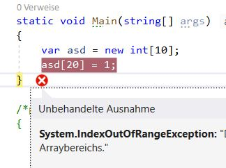
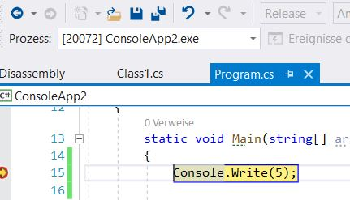
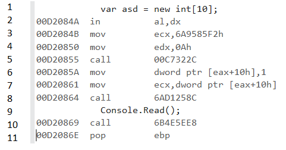
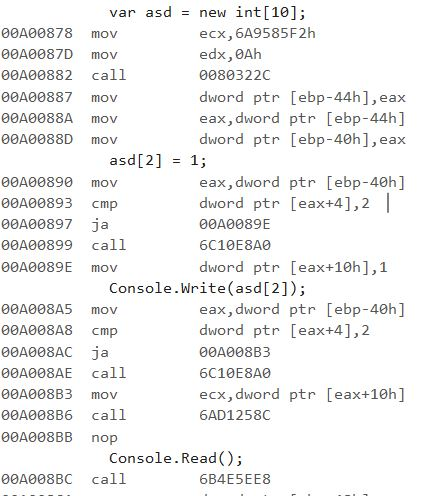

A few days ago I stumbled across a performance issue in our app. It is written in C# and compiled against .NET 4.7.2. After doing some investigation I wanted to take a deeper look into the implicit array bounds checks of .NET. 

>If you want to read more about my process of analyzing that stuff, stay tuned! I will write more about it in a few days!

So I tried to reproduce that behavior in a very small console app but did not succeed. The key here was the optimizations that were done by the JIT compiler.

# Implicit array bounds checks
Consider this example:

```cs
1: var array = new int[10];
2: array[20] = 1;
```

What will happen? An `IndexOutOfRange` exception will be thrown. This is possible because .NET ensures that the index is lower then the size of the array. Of course that check costs time so I wanted to know if I would be able to omit those checks.

I put a breakpoint at line 2, switched to the `Release` profile and started debugging.

>**Note:** The reasons for that and how you can get the `ASM` code is something I will show in a subsequent blog post.

I expected the runtime to stop at position 2 but what really happened:



My breakpoint was skipped and I first I did not know why this happens.

# Debugging in Release mode

Well, this is possible. VS will warn you but you can continue debugging, though.

Consider this example:

```cs
static void Main(string[] args)
{
    Console.Write(5);
}
```

The breakpoint is hit event though I am in a release build.


# Another example

First I thought this has something to do with the array bounds violation so I tried this one:

```cs
1: static void Main(string[] args)
2: {
3:    var asd = new int[10];
4:    asd[2] = 1;
5:    Console.Write(asd[2]);
6:}
```

I placed a breakpoint at line 5 and was sure that this time my breakpoint must be hit. But no. I started the program and it closes immediately. Very disappointing.

# Next try

```cs
static void Main(string[] args)
{
    var asd = new int[10];
    asd[2] = 1;
    Console.Write(asd[2]);
    Console.Read();
}
```

I added `Console.Read()`. Now the console must keep open. So I would be able to pause the execution and take a look at the `ASM` code. And I was right. The `Read()` forces the console to keep open. I press the `pause` button and the execution stopped. Finally I was in the debug mode and could take a look at the ASM code:



What is happening here:
+ **Line 5** executes the `new` operator. It's result (memory address of the array) is stored in the `EAX` register (mostly `EAX` is used for returning values)
+ **Line 6** inserts `1` into the memory. The address is in `EAX`. Every managed object in .NET has some metadata. In this case the first 8 bytes are reserved for metadata. Position `0` in the array would be `[eax + 8]`, position `1` = `[eax + 12]` and our requested index `2` = `[eax + 16]`. This depends on your CPU architecture of course.
+ **Line 7-8** executes `Console.Write`

Maybe you noticed the abstinence of our local variable `asd`? Also if you are not familiar with ASM code, you should realize that no local variables are involved here. And that is exactly the reason why the breakpoint was never hit. The JIT compiler understood that the local variable was not really necessary, omitted it and held the reference to the array in the register `EAX` all the time. Visual Studio now was not able anymore to map the executed code back to our source code and thus no breakpoint was hit.

# The same in debug mode
When you start your code in debug mode, you expect that the code does exactly what you have written. Visual Studio knows this and does no optimizations in the debug mode. This leads to local variables that are not necessary and so on.



# Conclusion

This simple example shows that the JIT compiler is clever enough to detect and avoid unnecessary code. But it also will make performance measurements more difficult. Just think about what would have happened if you have a more complex example with more local variables in a loop or something else. You get completely wrong results if you were taking performance measures in debug mode!

----

# Found a typo?
As I am not a native English speaker, it is very likely that you will find an error. In this case, feel free to create a pull request here: https://github.com/gabbersepp/dev.to-posts . Also please open a PR for all other kind of errors.

Do not worry about merge conflicts. I will resolve them on my own. 
