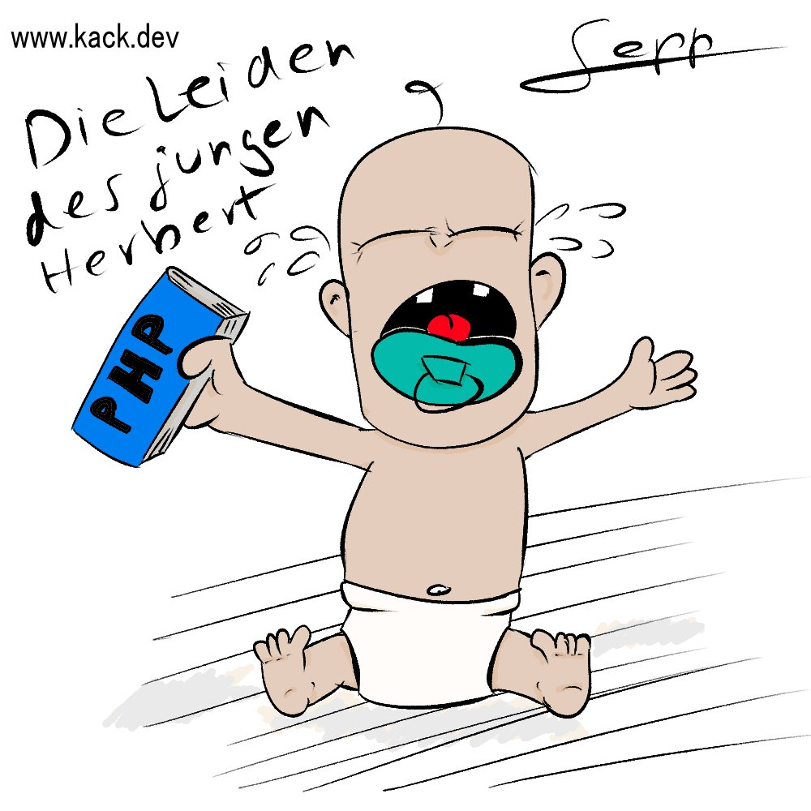

From time to time I am drawing cartoons with relation to our beloved programming doings. I am publishing them here, too. Have fun! Most of them will be in German but I am posting the english translation, too.
The main character in my developer cartoons is `Herbert`.

----

**The suffering of the young Herbert**

Herbert got a `PHP` book for his birthday. Maybe not the best idea.

----

# Found a typo?
As I am not a native English speaker, it is very likely that you will find an error. In this case, feel free to create a pull request here: https://github.com/gabbersepp/dev.to-posts . Also please open a PR for all other kind of errors.

Do not worry about merge conflicts. I will resolve them on my own. 
