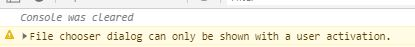
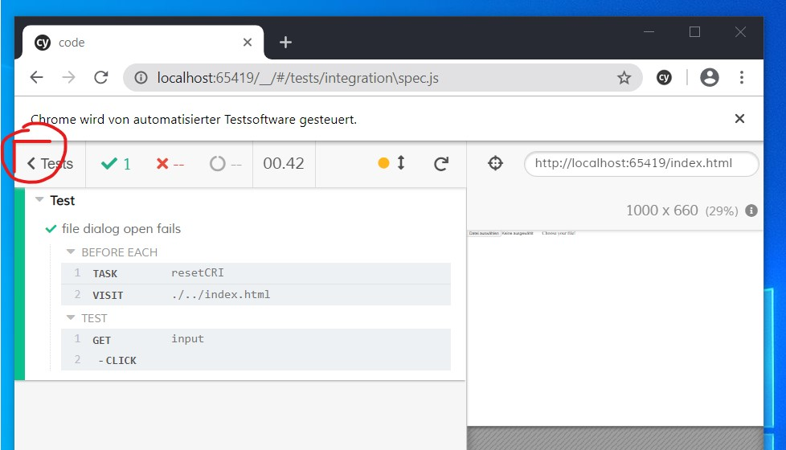
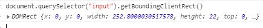
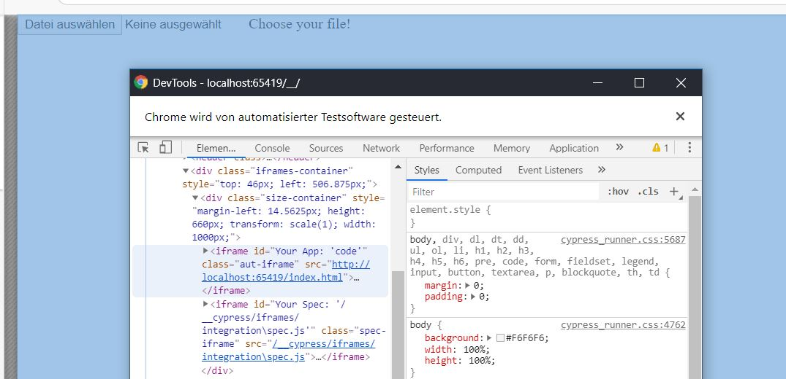
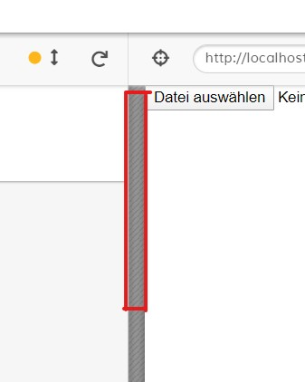
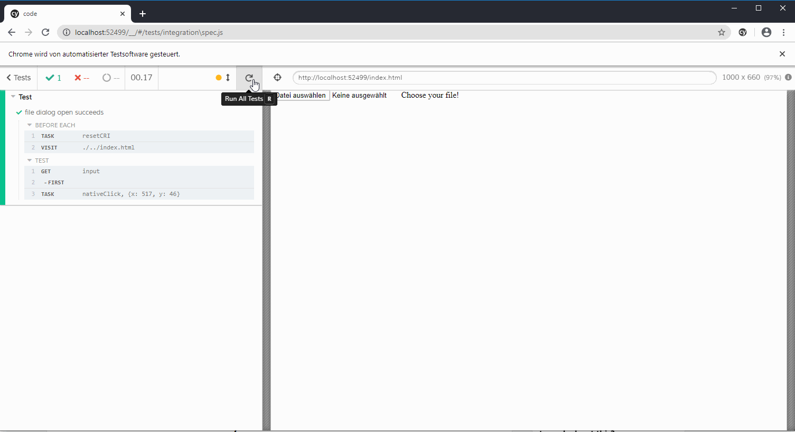

>**Note**: Get the code [here](https://github.com/gabbersepp/dev.to-posts/tree/master/blog-posts/cypress-native-event/code)

There are some rare cases where `cy.get(...).click()` won't work properly. If you encounter such a situation, you should give this approach a try. In this post we are opening the file chooser programmatically by click.

# Application under test
We use a very simple HTML construct:

```html
<!-- ./code/index.html -->

<html>
<head>
    <style>
        html, body {
            margin: 0;
            padding: 0;
        }
    </style>
</head>
<body>
    <input type="file">Choose your file!</input>
</body>
</html>

```

So nothing special. Let's now write a test that clicks into that button.

# Open file dialog

We do a simple `cy.get("input").click();`. You should now see nothing. Open the DevTools and you should see a warning:



Opening the file chooser by code has been disabled due to security reasons, which makes sense of course.

# Native events vs. synthetic events

`Synthetic events` are called that ones you call normally in your code, like `$el.click()`. They are simulated and produced by `Javascript`. `Native events` are produced by the browser. The latter simulate the user behavior better but lack the possibility that synthetic events provide. 

Using a native click event you can instruct the browser to **click onto the screen at position x:y** whereas using a synthetic click you can instruct to **trigger a click event on element `div[id='test']`**. So what is the difference? Imagine a `button` that is covered completely by a `div` whose `z-index` is higher. Doing a native click onto the button won't have an effect because the `div` receives it. Doing a synthetic click onto the `button` will trigger the button's click event handler.

# Trigger native events

Native events can be emitted by at least two different approaches:
+ using Windows Messages (low level Win32 API call to `SendMessage`)
+ using Chrome Debugger Protocol

As I don't think that `Windows Messages` is necessary, I will focus on the latter :smile:

# Chrome Debugger Protocol
I've already written a blog post about using it in `Cypress`, so I won't repeat everything.



# Mouse event
The method for emitting a mouse event is called [Input.dispatchMouseEvent](https://chromedevtools.github.io/devtools-protocol/tot/Input/#method-dispatchMouseEvent) and needs at least following parameters to work for our use case.

**Pressing the mouse**
```
{
    "id": 1,
    "method": "Input.dispatchMouseEvent",
    "params": {
        "type": "mousePressed",
        "button": "left",
        "x": ...,
        "y": ...,
        "clickCount": 1
    }
}
```

**Releasing it**
```
{
    "id": 2,
    "method": "Input.dispatchMouseEvent",
    "params": {
        "type": "mouseReleased",
        "button": "left",
        "x": 519,
        "y": 46,
        "buttons": 1,
        "clickCount": 1
    }
}
```

When releasing it you must set `buttons` to `1` which tells chrome that when sending the `Release` event, the left mouse button is pressed. Leaving this optional parameter empty did not work for me. 

The **x** and **y** coordinates are relative to the top left edge in the viewport:



# Getting X and Y

You might come up with the idea to do this to get the X/Y coordinates:

```js
cy.get("input").then($elements => {
  var first = $elements[0];
  var rect = first.getBoundingClientRect();
  var x = rect.x;
  var y = rect.y;
})
```

Unfortunately this is not correct:



In the picture it shows `0` for both, x and y. But `(0|0)` would produce a click to the top left edge of the viewport which is not what we want. The problem is that Cypress renders the application within an `iframe`:



But a native click event does not know what an `iframe` is. And the application does not know that there is a world outside of it. 

To solve this issue you can select the `div` with the class `size-container` (it contains the `iframe`), retrieve its `x` and `y` and adding them onto the element's `x` and `y`. But keep in mind that there are `iframes` involved so you must choose the right one:

```js
// ./code/cypress/integration/spec.js#L10-L25

it('file dialog open succeeds', () => {
  const sizeContainer = window.frames["parent"].document.querySelector(".size-container");
  const cypressAppFrameContainerRect = sizeContainer.getBoundingClientRect();
  const marginLeft = parseFloat(getComputedStyle(sizeContainer).marginLeft);

  // pixel values passed to chrome debugger protocol must be integer
  const addX = Math.ceil(cypressAppFrameContainerRect.x + marginLeft);
  const addY = Math.ceil(cypressAppFrameContainerRect.y);

  cy.get("input").first().then($element => {
    const element = $element[0];
    element.scrollIntoView();
    var rect = element.getBoundingClientRect();
    cy.task("nativeClick", {x: parseInt(rect.x) + addX, y: parseInt(rect.y) + addY });
  })
})
```

`element.scrollIntoView();` is necessary because we can't do a native click onto an element that is not within the visible area!

You also have to add the left-margin:



# Sending the event
Based upon the logic from the mentioned blog post we add a new Cypress task:

```js
// ./code/cypress/plugins/index.js#L30-L35

nativeClick: async({ x, y }) => {
  client = client || await CDP({ port })
  await client.Input.dispatchMouseEvent( { type: "mousePressed", x, y, button: 'left', clickCount: 1 });
  await client.Input.dispatchMouseEvent( { type: "mouseReleased", x, y, button: 'left', clickCount: 1, buttons: 1 });
  return Promise.resolve(true);
},
```

# Result
Of course this code will open the file dialog :smile:



# Troubleshooting
When using this approach you should close the DevTools because otherwise the click event may be received by the DevTool Window. I haven't investigated this yet but maybe the command chooses the first available window to be fired on. If you need the DevTools to be opened during that command you should consider to take a look into the [Chrome DevTools protocol](https://chromedevtools.github.io/devtools-protocol/) to find a way to choose the right window.

# Summary
I have shown you how to do native events with Cypress. Do you ever had to use native events? let me know. I'm interested in the real world use cases.

----

# Found a typo?
As I am not a native English speaker, it is very likely that you will find an error. In this case, feel free to create a pull request here: https://github.com/gabbersepp/dev.to-posts . Also please open a PR for all other kind of errors.

Do not worry about merge conflicts. I will resolve them on my own. 
