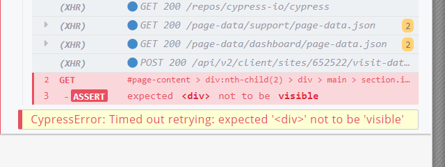
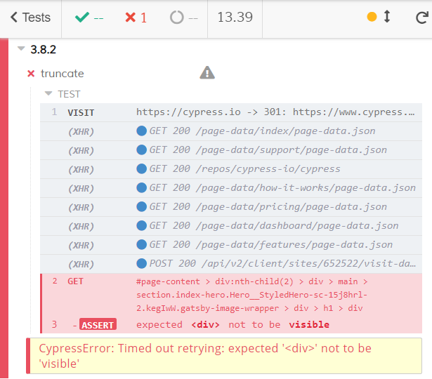
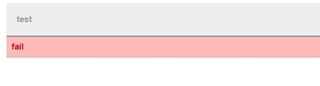
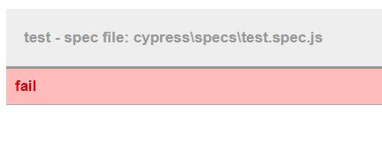

>**Note:** In this series I show you changes that are relevant for my private projects and my projects at work. Please go to [Cypress.io](https://docs.cypress.io/guides/references/changelog.html) for a full reference.

In [Cypress 3.8.3](https://docs.cypress.io/guides/references/changelog.html#3-8-3) following changes are most valuable for my usecases:

+ truncate messages from `cy.get` at 50 lines in the command log.
+ `file` property is now available in custom reporters

# Truncate at 50 lines
Imagine a selector that is very long:

`.get("#page-content > div:nth-child(2) > div > main > section.index-hero.Hero__StyledHero-sc-15j8hrl-2.kegIwW.gatsby-image-wrapper > div > h1 > div")`

If the `get` fails, you see this in the command log:

Unfortunately from this screen you will never be able to determine the full selector. This may be irrelevant in many cases but at work we have very complex and nested selectors and there it matters how the full selector looks like.

Now, after upgrading to `3.8.3` you see this:

This will helps us a lot with our work!

# `File` property

We use Jenkins to collect test results from cypress and jest. A custom script generates a HTML report for us. Unfortunately a failed tests looks like this:

If you now want to check your spec file, you have to do a full text search with the spec name. This is annyoing and costs time.

**Now** you can access the `file` attribute within the reporter. And after applying the change, your html report looks like this:

----

# Found a typo?
As I am not a native English speaker, it is very likely that you will find an error. In this case, feel free to create a pull request here: https://github.com/gabbersepp/dev.to-posts . Also please open a PR for all other kind of errors.

Do not worry about merge conflicts. I will resolve them on my own. 