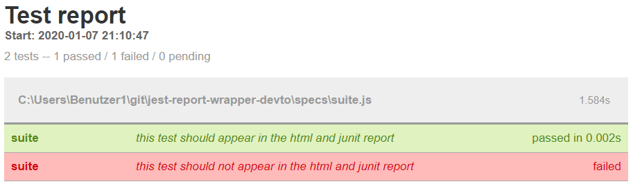

Today we stumbled over a problem in our API test infrastructure that induced some brainwork to fix it. In this article I show you how you can build your own Jest reporter and also how you can wrap existing reporters to filter out specific test results.

# Our use case
We skip tests conditional under specific circumstances. To keep our reports clean we want to filter out skipped tests. A skipped test contains only the term **Skipped** in it's name. So we want to omit all tests that are named **Skipped**.

If we have this `javascript` code:
```js
// code/jest.spec.js

describe("suite", () => {
  it("this test should appear in the html and junit report", () => {
    expect(true).toBe(true)
  })

  it("this test should not appear in the html and junit report", () => {
    expect(false).toBe(true)
  })
})

```

This procudes this **HTML** result:



And this JUNIT result:

```xml
<!-- code/junit-before.xml -->

<?xml version="1.0" encoding="UTF-8"?>
<testsuites name="jest tests" tests="2" failures="1" time="2.823">
  <testsuite name="suite" errors="0" failures="1" skipped="0" timestamp="2020-01-07T20:10:48" time="1.584" tests="2">
    <testcase classname="suite this test should appear in the html and junit report" name="suite this test should appear in the html and junit report" time="0.002">
    </testcase>
    <testcase classname="suite this test should not appear in the html and junit report" name="suite this test should not appear in the html and junit report" time="0.003">
      <failure>Error: expect(received).toBe(expected) // Object.is equality
</failure>
    </testcase>
  </testsuite>
</testsuites>
```
# The idea
I read through the "Jest" documentation, but found nothing to do with any filter logic. We also don't want to change existing reporters. So the only solution is to pack an existing reporter into an own reporter that does not pass on all test results.

# Writing an Jest reporter


# Additional Resources
+ [A very good explanation of the `Jest` reporter interface](https://medium.com/@colinwren/writing-a-jest-test-reporter-cb7c123ec211)
+ [Empty `Jest` reporter template](https://github.com/colinfwren/jest-reporter-debug/blob/master/src/index.js)

----

# Found a typo?
As I am not a native English speaker, it is very likely that you will find an error. In this case, feel free to create a pull request here: https://github.com/gabbersepp/dev.to-posts . Also please open a PR for all other kind of errors.

Do not worry about merge conflicts. I will resolve them on my own. 
