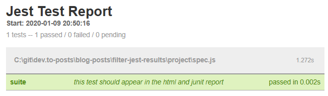

>**Example files:** You'll find the example code [in the blog post's project directory](https://github.com/gabbersepp/dev.to-posts/tree/master/blog-posts/filter-jest-results/project/README.md)

A few days ago we stumbled over a problem in our API test infrastructure that induced some brainwork to fix it. In this article I show you how you can build your own Jest reporter and also how you can wrap existing reporters to filter out specific test results.

# Our use case
We skip tests conditional under specific circumstances.

How is this done? Well we have overwritten `describe() & it()` and if we encounter a situation where we must skip the test, we do not pass the original arguments to the original function but use this construct:

```js
  describe('Skipped', () => {
    it("Skipped", () => { return; });
  });
```

Similar works the replacement for `it()` that allows us to execute tests within a `describe` but skip specific ones. 

To keep our reports clean we want to filter out skipped tests.
So we can omit all tests that are named **Skipped**.

**This is our spec file:**

wichtgi: nur grüne fälle nutzen, weil wir später im code auch nur die success subtrahieren

```js
// code/jest.spec.js

describe("suite", () => {
  it("this test should appear in the html and junit report", () => {
    expect(true).toBe(true)
  })

  it("Skipped", () => {
    expect(true).toBe(true)
  })
})

```

**And the `jest` config:**

```js
// code/jest.config-before.js

module.exports = {
  reporters: [
      "default",
      "jest-junit",
      ["jest-html-reporter", {
        "pageTitle": "Jest Test Report"
        }]
  ],
  testMatch: ["<rootDir>/spec.js"]
};

```

Which results in following results:

**HTML**:


**JUNIT**:

```xml
<!-- code/junit-before.xml -->

<?xml version="1.0" encoding="UTF-8"?>
<testsuites name="jest tests" tests="2" failures="0" time="9.87">
  <testsuite name="suite" errors="0" failures="0" skipped="0" timestamp="2020-01-09T19:48:00" time="2.451" tests="2">
    <testcase classname="suite this test should appear in the html and junit report" name="suite this test should appear in the html and junit report" time="0.003">
    </testcase>
    <testcase classname="suite Skipped" name="suite Skipped" time="0">
    </testcase>
  </testsuite>
</testsuites>

```

Obviously we want this output:

**HTML:**


**JUNIT:**
```xml
<!-- code/junit-after.xml -->

<?xml version="1.0" encoding="UTF-8"?>
<testsuites name="jest tests" tests="1" failures="0" time="2.124">
  <testsuite name="suite" errors="0" failures="0" skipped="0" timestamp="2020-01-09T19:50:17" time="1.272" tests="1">
    <testcase classname="suite this test should appear in the html and junit report" name="suite this test should appear in the html and junit report" time="0.002">
    </testcase>
  </testsuite>
</testsuites>

```

# The idea
I read through the "Jest" documentation, but found nothing to do with any filter logic. We also don't want to change existing reporters. So the only solution is to pack an existing reporter into an own reporter that does not pass on all test results. Also some test measurements must be adjusted, like the amount of total tests and so on.

# Writing an Jest reporter
So our first goal is to write an own jest reporter. It's basic structure is very simple as you can see:

```js
// code/jest-reporter-empty.js

class ReporterWrapper {
  constructor(globalConfig, options) {
  }

  onRunStart(runResults, runConfig) {
  }

  onTestResult(testRunConfig, testResults, runResults) {
  }

  onRunComplete(test, runResults) {
  }
}

module.exports = ReporterWrapper;

```

Writing a reporter is simple. You just do anything you want within those methods, save the file anywhere and then reference your reporter in the `jest.config.js` among the other reporters:

```js
// code/jest.config-own-reporter.js

module.exports = {
  reporters: [
      "default",
      "jest-junit",
      "jest-html-reporter",
      "relative/path/to/jest-report-wrapper.js"
  ],
  testMatch: ["<rootDir>/specs/*.js"]
};

```

:exclamation: **Attention**:
`Jest` passes the same instance of test results through all reporters. And it seems that the list of reporters is worked off beginning with the first. So **changes** made to the results in the first reporter are **visible in the subsequent reporters**, too.

# The structure of the test results
> **_NOTE:_** 
I don't want to go to deep into the meaning of the arguments because there are many good resources in the web. Please see the [Additional Resources](#additional-resources) section for further information.

`testResults` contains the result of the last executed spec file. `runResults` contains all results from within one execution. The structure (only the relevant parts) of the `testResults` looks like this:

<!-- embedme code/testResults.json -->
```json
{
  "numPassingTests": 5,
  "testFilePath": "path/to/spec.js",
  "testResults": [
    {
      "ancestorTitles": [
        "SelectField Component"
      ],
      "title": "renders text input correctly"
    }
  ]
}

```
`ancestorTitles` contains a list of parent names. They come from `descibe()` and nested `describe()`. 

And the `runResults`'s structure looks like this:

<!-- embedme code/runResults.json -->
```json
{
  "numPassedTestSuites": 15,
  "numTotalTestSuites": 15,
  "numPassedTests": 46,
  "numTotalTests": 46,
  "testResults": [
    "here are testResults"
  ]
}

```

# Cleaning the test results
When a reporter callback is hit, we only had to check the `title` and the list of `ancestorTitles` if the word **Skipped** is found. If yes, the testresult is removed and the result counts are decreased by one.

After all tests run, the callback `onRunComplete` is hit and we must adjust the total testcounts.

Let's go!

## The options
Of course we have to tell the wrapper what kind of underlying reporter exist and also which options those reporter need.

As every reporter receives the same testresult instance, it makes sense to configure the wrapper once and pass all existing reporter into it. I just left the `default` reporter untouched because I didn't want to mess around with Jest's internals.

```js
// project/jest.config.js

module.exports = {
  reporters: [
    "default",
    ["jest-report-wrapper.js",
      [
        { underlying: "jest-junit" },
        {
          underlying: "jest-html-reporter",
          underlyingOptions: {
            "pageTitle": "Jest Test Report"
          }
        }
      ]
    ]
  ],
  testMatch: ["<rootDir>/spec.js"]
};

```

## The constructor
First we need to do some initializing stuff.

```js
// project/jest-report-wrapper.js#L2-L2

constructor(globalConfig, options) {
```

`options` contains exactly the options from the reporter config. So it looks like this:

```js
// project/jest.config.js#L5-L13

[
  { underlying: "jest-junit" },
  {
    underlying: "jest-html-reporter",
    underlyingOptions: {
      "pageTitle": "Jest Test Report"
    }
  }
]
```

What we have to do is real obvious:
+ load the module whose path is in `underlying`
+ create `new` instance and pass the reporter's options

```js
// project/jest-report-wrapper.js#L2-L11

constructor(globalConfig, options) {
  this._globalConfig = globalConfig;
  this._options = options;
  this.underlyingReporters = [];

  this.underlyingReporters = underlyingReporter.map(r => {
    const resolved = require(r.underlying);
    return new resolved(globalConfig, r.underlyingOptions);
  })
}
```

## onStart callback
We are not interested in this callback as it has no real meaning, so we pass on all arguments without modifications.

```js
// project/jest-report-wrapper.js#L13-L19

onRunStart(runResults, runConfig) {
  this.underlyingReporters.forEach(r => {
    if (r.onRunStart) {
      r.onRunStart(runResults, runConfig)
    }
  })
}
```

## onTestResult callback

We start by searching single tests that match the criteria. If one is found, it is removed. 
`testResults` consists of several single tests. So we must check every single one if it's name is **Skipped** or if one of it's parent names is **Skipped**. `removed` represents the amount of removed results and is used to adjust the testresult counts.

```js
// project/jest-report-wrapper.js#L21-L32

onTestResult(testRunConfig, testResults, runResults) {
  const removed = this.processSpecFile(testResults);
  testResults.numPassingTests -= removed;
  runResults.numPassedTests -= removed;
  runResults.numTotalTests -= removed;

  this.underlyingReporters.forEach(r => {
    if (r.onTestResult) {
      r.onTestResult(testRunConfig, testResults, runResults)
    }
  })
}
```

```js
// project/jest-report-wrapper.js#L52-L66

processSpecFile(specFile) {
  let removed = 0;
  for (let testIndex = 0; testIndex < specFile.testResults.length; testIndex++) {
    const test = specFile.testResults[testIndex];
    if (test.ancestorTitles.indexOf("Skipped") > -1 || test.title === "Skipped") {
      // test was skipped thus remove it
      specFile.testResults.splice(testIndex, 1);
      removed++;
      // adjust indexCount because 'specFile.testResults.length' has been updated due to the 'splice'
      testIndex--;
    }
  }

  return removed;
}
```

## onRunComplete callback

After all tests have been executed, this callback is called. We should remove the testsuites, that are empty, from the `runResults` to keep the results clean and also to avoid unwanted behaviour in the reporter. If an empty testsuite is found, it is removed and the total result counts are adjusted.

```js
// project/jest-report-wrapper.js#L34-L50

onRunComplete(test, runResults) {
  for (let i = 0; i < runResults.testResults.length; i++) {
    let tr = runResults.testResults[i];
    if (tr.testResults.length == 0) {
      runResults.testResults.splice(i, 1);
      i--;
      runResults.numPassedTestSuites -= 1;
      runResults.numTotalTestSuites -= 1;
    }
  }

  this.underlyingReporters.forEach(r => {
    if (r.onRunComplete) {
      r.onRunComplete(test, runResults)
    }
  })
}
```

# Summary


# Additional Resources <a name="additional-resources">
+ [A very good explanation of the `Jest` reporter interface](https://medium.com/@colinwren/writing-a-jest-test-reporter-cb7c123ec211)
+ [Empty `Jest` reporter template](https://github.com/colinfwren/jest-reporter-debug/blob/master/src/index.js)

----

# Found a typo?
As I am not a native English speaker, it is very likely that you will find an error. In this case, feel free to create a pull request here: https://github.com/gabbersepp/dev.to-posts . Also please open a PR for all other kind of errors.

Do not worry about merge conflicts. I will resolve them on my own. 
