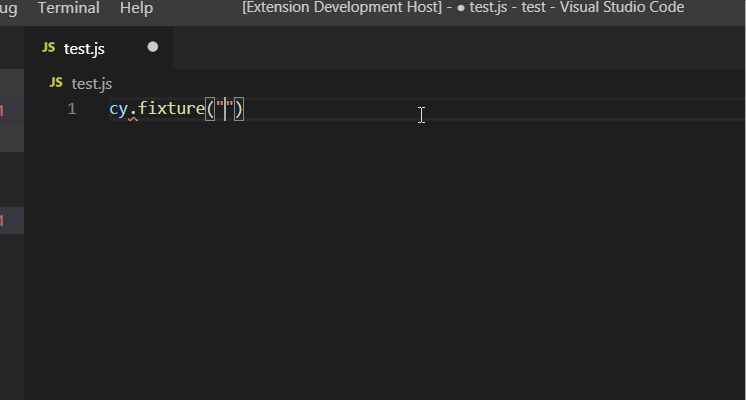

# Intellisense for Cypress Fixture Files
Are you tired of looking for the right file path for cypress fixtures, copying it and pasting it into cy.fixture () or cy.route ()? Then this article will help you!

# Why you should use fixtures and how to use them
Fixture files provide test data of any kind. In Cypress they can be used to load data (e.g. predefined user data) or tell `XHR` requests to return specific data.

If you have not explicitly disabled fixtures in cypress, the default path to the fixture's directory is `cypress/fixtures`. You can change this in the `cypress.json` config file:
```json
{
    "fixturesFolder": "path/to/fixtures/relative/to/cypress.json"
}
```


# The problem with them
I started to use them a few weeks ago and after a few days I had a bunch of files in `cypress/fixtures`, divided up into several directories.

If I now want to use one of them, the typical process is like:

* write down `cy.fixture("")`
* scroll in the VSCode file explorer up to the fixtures folder, search the right one
* jump into the windows explorer of that file and copy the whole path (to include sub directories as well)
* paste everything into the command

This is very annoying because it breaks my programming flow.

# The solution
I was thinking about how cool it would be if VSCode can suggest me the file that I am searching. In exactly the way as you get suggestions for property names and so on. 
But unfortunately there was not any extension that offers me this features. And if a developer reaches this point at anytime, this is mostly the start of a new project ;-P

# Cypress Fixture-IntelliSense
And that was the birth of this small but helpful extension. You find it in [the VSCode marketplace](https://marketplace.visualstudio.com/items?itemName=JosefBiehler.cypress-fixture-intellisense). 

# Usage
Currently it supports:

* cy.fixture()
* cy.route()

## cy.fixture()
Type anywhere in your JS/TS file:
```js
cy.fixture("")
```
Then ensure that the cursor is placed between the double quotes (normally this is the default behavior in VSCode). Now press `STRG + Space` (On Windows) to trigger the Intellisense.

## cy.route()
Type anywhere in your JS/TS file:
```js
cy.route("...", /route/, "")
```
Then ensure that the cursor is placed between the last double quotes (normally this is the default behavior in VSCode). Now press `STRG + Space` (On Windows) to trigger the Intellisense.

## File filter
The extension also supports filtering based on the input made between the double quotes.
E.g. if you write `cy.fixture("test")` and the cursor is placed after **t**, then you will only see files that contains `test` in its filename.

## Example



# Do you miss anything?
Do you have any change requests for the extension? Do you miss something or you found a bug? Do not hesitate to open a new issue at Github or write a comment under this post.

----

# Found a typo?
As I am not a native English speaker, it is very likely that you will find an error. In this case, feel free to create a pull request here: https://github.com/gabbersepp/dev.to-posts . Also please open a PR for all other kind of errors.

Do not worry about merge conflicts. I will resolve them on my own. 