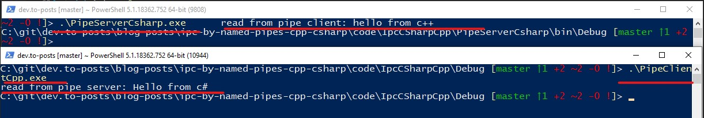

>**Note**: Get the full working example here: [Sample project](https://github.com/gabbersepp/dev.to-posts/tree/master/blog-posts/ipc-by-named-pipes-cpp-csharp/code/IpcCSharpCpp)

While [writing my own .NET profiler](https://dev.to/gabbersepp/create-a-net-profiler-with-the-profiling-api-start-of-an-unexpected-journey-198n) I realized one problem: The profiler, written in C++, must be a DLL. If I want to provide a GUI, I want to do this with C# and WPF. In a private project I used `named pipes` for inter process communication to let a `NodeJS` process communicate with a `C#` application so I decided to do the same with my profiler.

In this article, we build a small runnable example with two-way communication and a very very simple protocol.

# Named vs anonymous pipes
I have chosen named pipes, because I want to setup a bidirectional channel. The pipe server (C# application) should be able to send a configuration to the pipe client (C++) and after this first data exchange, only the client is sending data.
[Anonymous pipes are one-way only](https://docs.microsoft.com/en-us/windows/win32/ipc/anonymous-pipes) as stated by Microsoft.

# Pipe Server (C#)
You have to use the class `NamedPipeServerStream`.

```cs
static void Main(string[] args)
{
  var namedPipeServer = new NamedPipeServerStream("my-very-cool-pipe-example", PipeDirection.InOut, 1, PipeTransmissionMode.Byte);
  var streamReader = new StreamReader(namedPipeServer);
  namedPipeServer.WaitForConnection();

  var writer = new StreamWriter(namedPipeServer);
  writer.Write("Hello from c#");
  writer.Write((char)0);
  writer.Flush();
  namedPipeServer.WaitForPipeDrain();

  Console.WriteLine($"read from pipe client: {streamReader.ReadLine()}");
  namedPipeServer.Dispose();
}
```

+ **pipe name:** Self explanatory
+ **direction:** I use `InOut` to be able to send something to the client
+ **maxNumberOfServerInstances:** This should be `1` if you have only one client and increase the value if you want to handle parallel clients. We will see this in action later on.
+ **transmission mode:** We are sending the data in a byte stream. This implies that the other side knows how many data should be sent. Easily, we just reading as long as no `\0` is received.
+ **Flush():** Just tell the server, that it should clear it's buffer right now.
+ **WaitForPipeDrain():** This will serialize the server & client by waiting until all bytes are read. 
+ **Caveat:** two lines above I'm sending `(char)0`. Please be aware of the cast! Without it, an integer is sent which means 4 bytes where all bits are set to 0. The receiver awaits only one zero byte and thus will not read the remaining three bytes. They will be left in the buffer which forces `WaitForPipeDrain()` to wait forever. The cast ensures that only one byte is sent.  
+ **ReadLine():** The client sends a string, terminated by `\r\n`. But you can build whatever protocol you want.

# Pipe Client (C++)
Also very simple:

```cpp
#include <windows.h>
#include <iostream>

HANDLE fileHandle;

void ReadString(char* output) {
  ULONG read = 0;
  int index = 0;
  do {
    ReadFile(fileHandle, output + index++, 1, &read, NULL);
  } while (read > 0 && *(output + index - 1) != 0);
}

int main()
{
  // create file
  fileHandle = CreateFileW(TEXT("\\\\.\\pipe\\my-very-cool-pipe-example"), GENERIC_READ | GENERIC_WRITE, FILE_SHARE_WRITE, NULL, OPEN_EXISTING, 0, NULL);

  // read from pipe server
  char* buffer = new char[100];
  memset(buffer, 0, 100);
  ReadString(buffer);

  std::cout << "read from pipe server: " << buffer << "\r\n";

  // send data to server
  const char* msg = "hello from c++\r\n";
  WriteFile(fileHandle, msg, strlen(msg), nullptr, NULL);
}
```

A few points that needs to be mentioned:

+ **pipe name**: On Windows, a pipe path must follow the naming convention: `\\\\.\pipe\<pipe-name>`. The dot is equal to `localhost` and can be replaced by remote server names. As a pipe is treated as a normal file, you have to specify the full path while in C# it is abstracted.
+ **Access rights:** When defining a two-way pipe, your client must request as well `read` as `write` rights.
+ **String termination:** As already seen in the server code, you must send `\r\n` at the end of the string. Of course, just a very simple "protocol specification".
+ **Transmission mode:** As stated in the [official Microsoft documentation](https://docs.microsoft.com/en-us/windows/win32/ipc/named-pipe-type-read-and-wait-modes), by calling `CreateFile` the pipe client is initially in byte transmission mode.

Compile both projects, execute the server first, than the client and you should get this result:


# Troubleshooting
If you have troubles in bringing both components together, there is an easy possibility to check if the pipe has been opened. Open a powershell window and type: `get-childitem \\.\pipe\`. This will print all open pipes:


# Concurrent clients
In the example above we can only handle one client. Multiple clients would be possible if you close the server and reopen it again. But to allow concurrent clients, you must create multiple instances of `NamedPipeServerStream`. Raising the `maxNumberOfServerInstances` parameter to 5 will allow 5 parallel connections. Using a number less than parallel instances leads to the exception `system.io.ioexception all pipe instances are busy`.

A very simple and error prone solution would be:

```cs
var instances = new Task[5];
for (int i = 0; i < instances.Length; i++)
{
  instances[i] = Task.Run(() =>
  {
    var namedPipeServer = new NamedPipeServerStream("my-very-cool-pipe-example", PipeDirection.InOut, 5, PipeTransmissionMode.Byte);
    var streamReader = new StreamReader(namedPipeServer);
    namedPipeServer.WaitForConnection();

    var writer = new StreamWriter(namedPipeServer);
    writer.Write("Hello from c#");
    writer.Write((char)0);
    writer.Flush();
    namedPipeServer.WaitForPipeDrain();

    Console.WriteLine($"read from pipe client: {streamReader.ReadLine()}");
    namedPipeServer.Dispose();
  });
}

// don't do this except you know what you are doing
Task.WaitAll(instances);
```

# Additional Links
+ [Microsoft Win32 documentation](https://docs.microsoft.com/en-us/windows/win32/ipc/named-pipes)

----

# Found a typo?
As I am not a native English speaker, it is very likely that you will find an error. In this case, feel free to create a pull request here: https://github.com/gabbersepp/dev.to-posts . Also please open a PR for all other kind of errors.

Do not worry about merge conflicts. I will resolve them on my own. 
