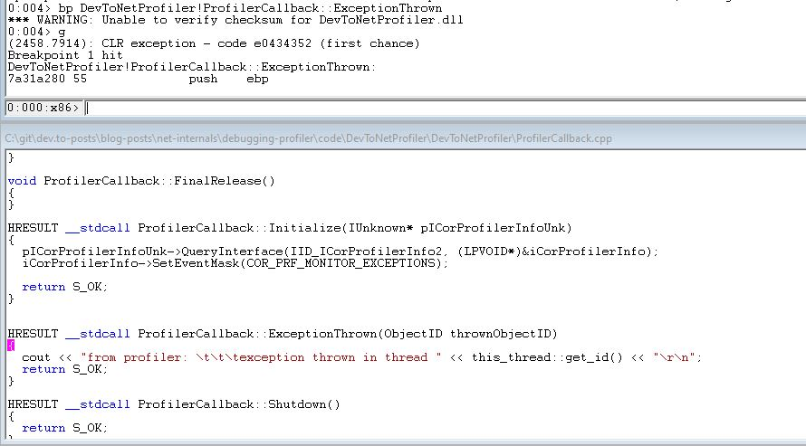
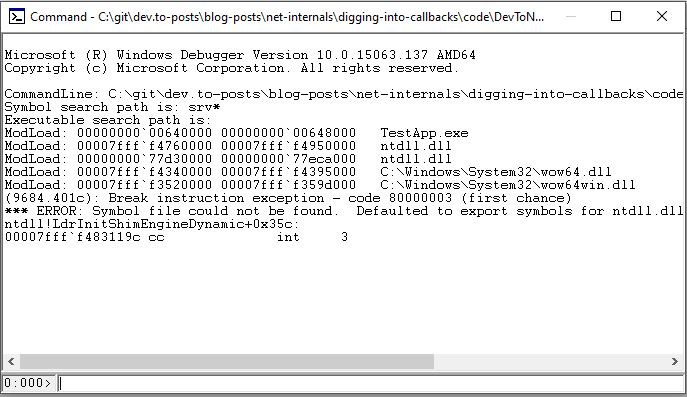
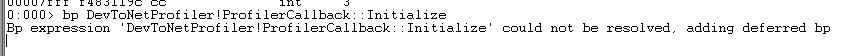
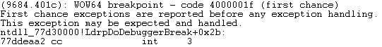
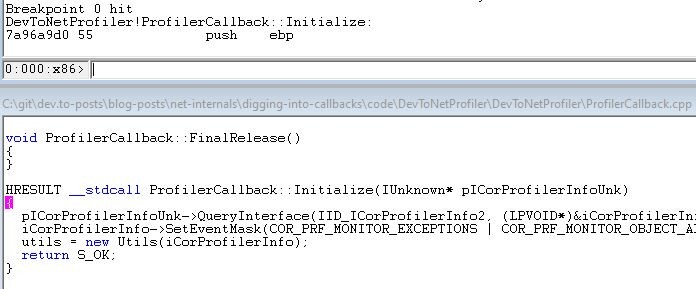

In this article I just summarize shortly how you can apply what I've already written to profiler:



# Code example
I just copied the [code from the last article](https://github.com/gabbersepp/dev.to-posts/tree/master/blog-posts/net-internals/how-does-profiler-work/code/DevToNetProfiler). Our goal is to set a breakpoint in `ProfilerCallback::ExceptionThrown` in line `33`. then we can inspect the parameter `objectID`. I will do this very quickly. If you want more information, go to the blog post I mentioned.

# Howto
+ Add a `Console.Read();` at the very beginning of the .NET test application. This gives us time to attach a debugger
+ Start app by executing `start.bat`
+ Start WinDbg & attach to process of `TestApp`
+ set breakpoint: `bp DevToNetProfiler!ProfilerCallback::ExceptionThrown`
+ enter `g + enter` to continue
+ enter any key in your `TestApp`
+ your breakpoint should be hit and you should see the source code:



+ go to `View > Locals` to list all local variables, including parameters:


# How to debug Initialize()?
Let's say you want to debug the `Initialize()` method. The steps above won't work because if you attach to the running process, the `Initialize()` has already finished. But don't worry, this can be done with a few extra steps.

## Adjust the `start.bat`
The key here is to expose the environment variables in the context where the `TestApp` is running. To do this you don't need to start the app directly from the batch file. So open `start.bat` and replace:

```
START TestApp/bin/Debug/TestApp.exe
```

with the path where the `WinDbg.exe` is on your PC:

```
START C:\Tools\WinDbg\windbg.exe
```

## Start WinDbg
Execute the batch file. WinDbg should now appear. 

## Execute TestApp.exe
Go to `File > Open Executable...` and select `TestApp.exe`. WinDbg should immediately stop the execution:



## Set a breakpoint
Do you remember the `defered breakpoints` I mentioned in my WinDbg blog post? As WinDbg stopped directly after `TestApp` was executed, nothing was loaded yet. So every breakpoint will be a `defered` one.

Enter the breakpoint:
```
bp DevToNetProfiler!ProfilerCallback::Initialize
```

And you should see this message:



## Continue
Enter `g + enter` to continue the execution. In my setup, WinDbg stops again with this message:



We don't care about that message so let the app continue again. Now the breakpoint is hit:




----


# Found a typo?
As I am not a native English speaker, it is very likely that you will find an error. In this case, feel free to create a pull request here: https://github.com/gabbersepp/dev.to-posts . Also please open a PR for all other kind of errors.

Do not worry about merge conflicts. I will resolve them on my own. 
