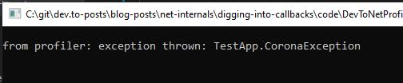
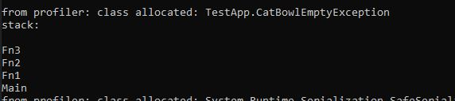

# A few callbacks explained
Until now we setup a simple profiler that is capable of logging every exception. Do you remember the output? It was just `exception thrown`, which may be useful but surely it will be much more useful if the exception name would be printed.

If you looked at several callback methods, you may have noticed, that often you get only an id. E.g. a `FunctionId` or a `ClassId` and such things. This makes sense as passing more information to the callbacks will increase the overall CPU & RAM load. On the other hand, you have to call a few methods to get more information. Unfortunately it is often not very obviously what kind of method you have to use. At least I found it a bit confusing. But maybe the whole process is documented somewhere in the .NET documentation :-)

To make your life easier, I will show you some use cases. I will not write too much about it. I mean, I'm only calling some functions in a very stupid manner. So if you have questions, please ask and I'll try to answer them.

# ExceptionThrown callback
Let's take the example project from the last lesson. There we implemented the `ExceptionThrown` callback. As parameter you only get an `ObjectID`. Wouldn't it be nice if we could print the name of the exception? Let's do this.

## Utils
I create an own class for the methods that retrieve more information about an event. Let's call it `Utils`. You should be aware that I will not write the most performant code and you may encounter a lot of things than could be improved. But be sure this was all done for an easier understanding.

## Get class name by object ID

```cpp
bool Utils::GetClassNameByObjectId(ObjectID objectId, char* output, ULONG outputLength) {
  ClassID classId;
  iCorProfilerInfo->GetClassFromObject(objectId, &classId);
  return this->GetClassNameByClassId(classId, output, outputLength);
}

bool Utils::GetClassNameByClassId(ClassID classId, char* output, ULONG outputLength) {
  ModuleID moduleId;
  mdTypeDef typeDefToken;
  IMetaDataImport* metadata;
  wchar_t* className = new wchar_t[outputLength];
  ULONG read = 0;

  HRESULT hresult = iCorProfilerInfo->GetClassIDInfo(classId, &moduleId, &typeDefToken);

  if (hresult < 0 || moduleId == 0) {
    return false;
  }

  hresult = iCorProfilerInfo->GetModuleMetaData(moduleId, ofRead, IID_IMetaDataImport, (IUnknown**)&metadata);
  hresult = metadata->GetTypeDefProps(typeDefToken, className, outputLength, &read, NULL, NULL);
  metadata->Release();

  memset(output, 0, outputLength);
  wcstombs(output, className, outputLength);
  delete[] className;
  return true;
}
```

Using this code:

```cs
static void Main(string[] args)
{
    try
    {
    throw new CoronaException();
    }
    catch
    {
    }

    Console.Read();
}
```

And this callback implementation:
```cpp
HRESULT __stdcall ProfilerCallback::ExceptionThrown(ObjectID thrownObjectID)
{
  char* className = new char[100];
  utils->GetClassNameByObjectId(thrownObjectID, className, 100);
  cout << "\t\nfrom profiler: exception thrown: " << className << "\r\n";
  delete[] className;
  return S_OK;
}
```

I'm getting that output:



# ObjectAllocated 
Set following flags to get notified about very allocated object: `COR_PRF_MONITOR_OBJECT_ALLOCATED | COR_PRF_ENABLE_OBJECT_ALLOCATED`. 

Implement the callback:

```cpp
HRESULT __stdcall ProfilerCallback::ObjectAllocated(ObjectID objectID, ClassID classID)
{
  char* className = new char[1000];
  if (utils->GetClassNameByClassId(classID, className, 1000)) {
    cout << "\t\nfrom profiler: class allocated: " << className << "\r\n";
  }
  delete[] className;
  return S_OK;
}
```

# Retrieving stacktraces
Let's say you want to observe all allocations of type `CatBowlEmptyException` and print out the stacktrace so you know where this happened. Fortunately the Profiler API provides you the `ICorProfilerInfo2::DoStackSnapshot` method which requests a stacktrace of the current thread (or of another one, but I won't cover this here). It awaits a pointer to a function that is called for every frame in the stacktrace. The requesting and the providing of the frames are synchronous which means, the next line after `DoStackSnapshot` is executed after the last frame was reported.

## Activate
You must use the flag `COR_PRF_ENABLE_STACK_SNAPSHOT` to be able to request snapshots:

```cpp
 iCorProfilerInfo->SetEventMask(.... | COR_PRF_ENABLE_STACK_SNAPSHOT);
```

## Signature of DoStackSnapshot
```cpp
DoStackSnapshot( 
/* [in] */ ThreadID thread,
/* [in] */ StackSnapshotCallback *callback,
/* [in] */ ULONG32 infoFlags,
/* [in] */ void *clientData,
/* [size_is][in] */ BYTE context[  ],
/* [in] */ ULONG32 contextSize)
```
+ **thread:** You can pass `0` which means you want to retrieve the stacktrace of the current thread.
+ **callback:** See the discussion below
+ **infoFlags:** Indicates whether a context containing the CPU state should be passed to the callback. In our simple example we don't care, so use `COR_PRF_SNAPSHOT_DEFAULT` here 
+ **clientData:** This is a pointer to anything you want to pass to the `callback`. You can use `0` if you don't want to pass anything.
+ **context:** `0` if you want to retrieve the stacktrace of the current thread
+ **contextSize:** also `0`

## Signature of the Callback

```cpp
DoStackSnapshotCallback(
	FunctionID funcId,
	UINT_PTR ip,
	COR_PRF_FRAME_INFO frameInfo,
	ULONG32 contextSize,
	BYTE context[],
	void* clientData
)
```

+ **funcId:** The `FunctionId` which can be used to get the function name. It is `0` if the current frame is an unmanaged function call. For this blog post I skip that frame in those cases.
+ **ip**: Instruction pointer
+ **frameInfo**: To be honest, I have no idea what data resists in that struct and I have not found any definition of that struct.
+ **contextSize, context:** both will be null because we don't request them for this blog post
+ **clientData:** exactly that thing you could pass in `DoStackSnapshot`.

## Getting the function name based on the `FunctionID`
Add a new function to `Utils.cpp`:

```cpp
bool Utils::GetFunctionNameById(FunctionID functionId, char* output, ULONG outputLength) {
  IMetaDataImport* metadata;
  mdMethodDef methodToken;
  mdTypeDef typeDefToken;
  wchar_t* functionName = new wchar_t[1000];
  ULONG wcbCount;
  memset(functionName, 0, 1000);
  iCorProfilerInfo->GetTokenAndMetaDataFromFunction(functionId, IID_IMetaDataImport, (IUnknown**)&metadata, &methodToken);
  metadata->GetMethodProps(methodToken, &typeDefToken, functionName, 1000, &wcbCount, NULL, NULL, NULL, NULL, NULL);
  wcstombs(output, functionName, outputLength);
  metadata->Release();
  delete[] functionName;
  return true;
}
```
I assumed that the last parameters of `GetMethodProps` are all optional. At least this compiles and runs without errors :-)

## Gimme the code - ObjectAllocated
We slightly adjust the `ObjectAllocated` callback:

```cpp
HRESULT __stdcall ProfilerCallback::ObjectAllocated(ObjectID objectID, ClassID classID)
{
  char* className = new char[1000];

  if (utils->GetClassNameByClassId(classID, className, 1000)) {
    cout << "\t\nfrom profiler: class allocated: " << className << "\r\n";

    if (strcmp(className, "TestApp.CatBowlEmptyException") == 0) {
      char* stack = new char[1000];
      memset(stack, 0, 1000);
      SnapshotClientData clientData;
      clientData.pUtils = utils;
      clientData.stacktrace = stack;

      iCorProfilerInfo->DoStackSnapshot(NULL, &DoStackSnapshotCallback, COR_PRF_SNAPSHOT_DEFAULT, &clientData, 0, 0);
      cout << "stack:\r\n" << stack;

      delete[] stack;
    }   
  }

  delete[] className;
  return S_OK;
}
```
`SnapshotClientData` is a struct created by me to transport the `Utils` object and a pointer to the stack char array:

```cpp
struct SnapshotClientData {
  Utils* pUtils;
  char* stacktrace;
};
```

## Gimme the code - DoStackSnapshotCallback
```cpp
HRESULT __stdcall DoStackSnapshotCallback(
  FunctionID funcId,
  UINT_PTR ip,
  COR_PRF_FRAME_INFO frameInfo,
  ULONG32 contextSize,
  BYTE context[],
  void* clientData
) {
  if (funcId == 0) {
    return S_OK;
  }

  SnapshotClientData* snapshotClientData = (SnapshotClientData*)clientData;
  char* output = snapshotClientData->stacktrace + strlen(snapshotClientData->stacktrace);
  output[0] = '\r';
  output[1] = '\n';
  output += 2;
  snapshotClientData->pUtils->GetFunctionNameById(funcId, output, 1000);

  return S_OK;
}
```

I manipulated the pointer `output` to append the next frame to `output` plus a `new line`. Not sure if this is considered to be best practice in `C++` :sweat_smile:

Please note that I added the callback not to the `ProfilerCallback` class because I did not succeed in passing a pointer to a member function into `DoStackSnapshot`.

## Outcome
Given a weird and senseless program with some nested calls I get this output:




# Additional Links
[DoStackSnapshot](https://docs.microsoft.com/de-de/dotnet/framework/unmanaged-api/profiling/icorprofilerinfo2-dostacksnapshot-method)

----

# Found a typo?
As I am not a native English speaker, it is very likely that you will find an error. In this case, feel free to create a pull request here: https://github.com/gabbersepp/dev.to-posts . Also please open a PR for all other kind of errors.

Do not worry about merge conflicts. I will resolve them on my own. 
