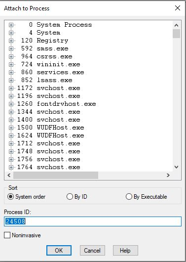
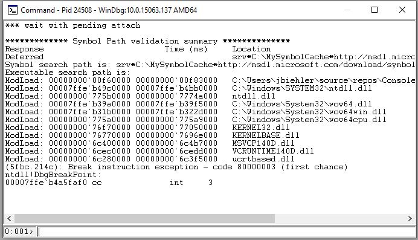
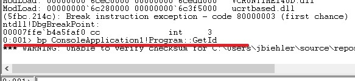
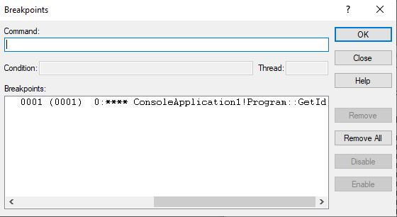
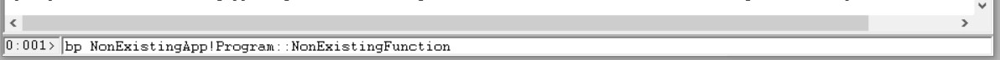
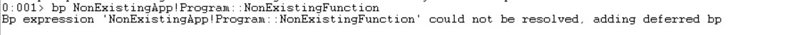
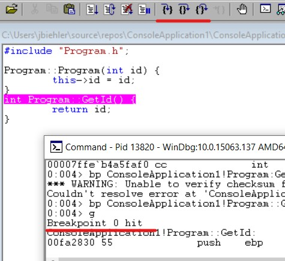
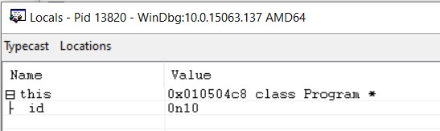
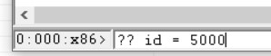
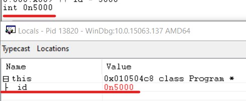

# Why use WinDbg if I have Visual Studio with a more user friendly debugger?
There are a few situations where this is necessary. At work we are developing a ASP.NET WebAPI. In the production environment you can not attach your Visual Studio to debug or analyze the memory. The latter is also a reason, you should make your familiar with WinDbg. It allows (of course as other tools, too) to analyze a memory dump, taken from any process.

During my spare time the last week I started to write a .NET profiler with C++. This is a small DLL that is loaded along with a normal .NET application and allows you to monitor your .NET application. For example you get notifications if a  class loads and so on. To debug that DLL I had to use WinDbg.

# Get WinDbg
You can get WinDbg from [here](https://docs.microsoft.com/en-us/windows-hardware/drivers/debugger/debugger-download-tools).

# Our sample app
I created a very stupid C++ application. Follow [this link](https://github.com/gabbersepp/dev.to-posts/tree/master/blog-posts/net-internals/how-to-debug-with-windbg/project) to get the full runnable example. [Here](https://github.com/gabbersepp/dev.to-posts/tree/master/blog-posts/net-internals/how-to-debug-with-windbg/exe) you get the compiled example. It consists of a class `Program`:

```cpp
// ./project/ConsoleApplication1/Program.cpp

#include "Program.h";

Program::Program(int id) {
	this->id = id;
}
int Program::GetId() {
	return id;
}
```

And a file that contains the entry point:

```cpp
// ./project/ConsoleApplication1/ConsoleApplication1.cpp

#include <iostream>
#include "Program.h";

int main()
{
    Program* pProgram = new Program(10);
    int dummy = 0;
    std::cout << "Press Enter to continue\n";
    std::cin >> dummy;
    std::cout << "Hello World!\n";
    std::cout << pProgram->GetId();
    return 0;
}
```

# Use WinDbg
First you should start the programm. Then open the task manager, find the process and copy the `PID` (in this example: `24508`):


## Provide symbols
You should tell WinDbg where it can find the symbols of the system libraries. Go to `File > Symbol File Path` and insert:

```
srv*C:\MySymbolCache*http://msdl.microsoft.com/download/symbols
```

This will download all microsoft symbols to `c:/MySymbolCache`. 

**The symbols of your app**
Sometimes WinDbg finds the symbols of the attached process automatically but not always. In the latter case, just copy the `ConsoleApplication1.pdb` file to `c:/MySymbolCache`. 

## Attach to the process
Go to `File > Attach to a process`, insert the `PID` at the bottom of the dialog and press `OK`.



If you get this view, everything works as expected:



WinDbg has now paused the program.

## Set a breakpoint
WinDbg provides three commands for placing breakpoints:

+ **bp**: Set a breakpoint
+ **bu**: Set a unresolved breakpoint
+ **bm**: Set breakpoints to symbols that match a pattern

### bp: Set a breakpoint
This is the "normal" way of placing a breakpoint. You specify the name of the application, followed by a exclamation mark and the path to the function name.

```
bp ConsoleApplication1!Program::GetId
```

If you get no error message (the `invalid checksum` can be ignored), you successfully  placed a breakpoint:



### Deleting a breakpoint
Go to `Edit > Breakpoints...` to get a list of all placed breakpoints. In this window you also can delete them.



### bu: Deferred breakpoint
Try this command:

```
bp NonExistingApp!Program::NonExistingFunction
``` 



Obviously this function does not exist. Also the application name is wrong. What WinDbg now creates is a so called `deferred breakpoint`:



A `deferred` or `unresolved` breakpoint is one that gets active as soon as the module `NonExistingApp` is loaded. If you use `bp` and specify a location that does not exist currently, then `bp` does the same as `bu`.

### bm: Set breakpoints to symbols that match a pattern
You also can specify a set of breakpoints by passing a pattern:

```
bm ConsoleApplication1!Program::*
```

This theoretically will place a breakpoint in all entry points that match that pattern. But during testing this command does  nothing. So I am not sure how to use this properly :-)

### Setting our breakpoint
For testing purposes we use `bp` as mentioned above:

```
bp ConsoleApplication1!Program::GetId
```

## Let the app run
As now WinDbg is attached and the breakpoint is set, we can continue. insert `g` into the WinDbg commandline and press enter. `g` continues the execution of `ConsoleApplication1`. Press any `key + enter` in the `ConsoleApplication1.exe` cmd. Now the application is paused and you should see this:



Also notice the red underlined buttons at the top. With those buttons you can jump through the source code. You are also able to set the cursor into any line and press `F9` to set a new breakpoint in this line.

## Read local variables and manipulate them
Press `F10` or one of the first two buttons to jump into the next line. The instruction pointer now is in line `return id;`. Go to `View > Locals` to open a new window with all local variables:



Let's say you want to return `5000` here. That is easy. Execute the command `?? id = 5000`:



Notice how the variable has changed:



# Summary
I showed you how you can easily debug your unmanaged application with WinDbg. I recommend you to make yourself familiar with WinDbg. It is a very powerful tool. Please keep in mind that for debugging a .NET application, you need some extra steps.

----

# More information
[Breakpoint Commands](https://docs.microsoft.com/en-us/windows-hardware/drivers/debugger/bp--bu--bm--set-breakpoint-)
[WinDbg Cheatsheet](https://theartofdev.com/windbg-cheat-sheet/)

# Found a typo?
As I am not a native English speaker, it is very likely that you will find an error. In this case, feel free to create a pull request here: https://github.com/gabbersepp/dev.to-posts . Also please open a PR for all other kind of errors.

Do not worry about merge conflicts. I will resolve them on my own. 
