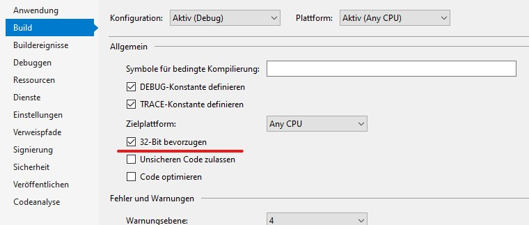
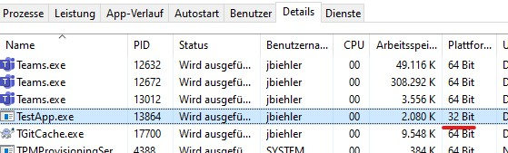
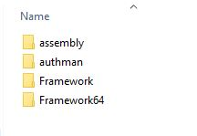
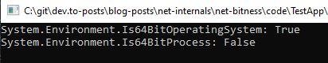

#  32Bit or 64Bit - Can  you tell?
While developing a .NET profiler, I struggled a bit with the bitness of my test application. So I decided to write down my findings. If you want to read more about the profiler, you should follow my series about it:

{% link https://dev.to/gabbersepp/create-a-net-profiler-with-the-profiling-api-start-of-an-unexpected-journey-198n }

# Any Cpu
Do you know this `Any Cpu`, that is selected per default in Visual Studio:


I see this all day long but never asked myself what this actually means. So I went to stackoverflow and found a very good [answer](https://stackoverflow.com/a/41766077/9809950).

||X86 Windows|x64 Windows|
|---|---|---|
|Any CPU|32 Bit app|64 Bit app|
|Any CPU (prefer 32Bit)|32 Bit app|WoW64 App (you know that simulation of 32Bit applications under Windows 64Bit)|

So using `Any CPU` you must not publish your app in two versions.

# Prefer 32 Bit
But what means `Prefer 32 Bit`? Right-click onto your project and go to `Properties > Build`. Here you should see a checkbox:



# Explicitly set the bitness
Above the checkbox you can set the bitness of your app explicitly in the `target platform` dropdown:


# Proving the bitness
OK. You compiled your app with `Any CPU` and you execute it somewhere. How can you determine the bitness? This is easy. Open the Taskmanager, find your process and read the content of the `platform` column:



# Installationpaths
You want to see the installed versions of .NET framework. On my Windows 10, the runtimes are installed in this path: `C:\Windows\Microsoft.NET`.



# Checking the bitness in your code
An old trick is to request the size of `IntPtr` which will be 4 bytes within a 32Bit process and 8 bytes within a 64Bit process:

```cs
Console.WriteLine($"IntPtr size: {IntPtr.Size}");
```

Since .NET4 you can use:

```cs
Console.WriteLine($"System.Environment.Is64BitOperatingSystem: {System.Environment.Is64BitOperatingSystem}");
Console.WriteLine($"System.Environment.Is64BitProcess: {System.Environment.Is64BitProcess}");
```

On my Windows I get this result:



# Summary
I think in most cases you don't need to care attention about the bitness. But if you have to, this article hopefully helps you a bit.

----

# Found a typo?
As I am not a native English speaker, it is very likely that you will find an error. In this case, feel free to create a pull request here: https://github.com/gabbersepp/dev.to-posts . Also please open a PR for all other kind of errors.

Do not worry about merge conflicts. I will resolve them on my own. 
