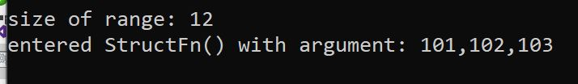
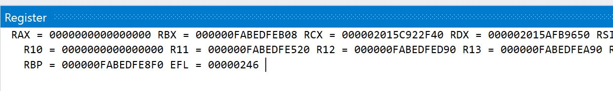
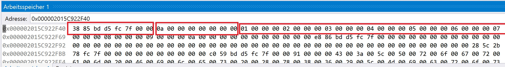

>**Get the full runnable example:** [here]()

Heute wollen wir uns anschauen, wie man Funktionsparameter und Rückgabewerte erfassen kann. Ausgangsbasis ist der Code aus dem letzten Blogpost. Dort hängen wir uns in die Function Enter/Leave Callbacks ein.

Aus dem Stand heraus hatte ich keine Idee, wie man anhand der Infos <add parameter of functio e ter> an die Parameter kommt. Nach längerer Suche bin ich jedoch auf diesen Issue gestoßen:

https://github.com/dotnet/docs/issues/6728

Der Ersteller hat das gleiche Problem wie ich. Ein mit der Materie vertrauter Entwickler hat ihm eine grobe Anleitung geschrieben, was getan werden muss. Dies wollen wir als Ausgangsbasis nutzen.

# Modifying the Assembler code
Aber bevor wir im C++ code weiter machen können, müssen wir die Parameter in den Assembler Callbacks anpassen. Die Funktionsdefinition lautet:

```cpp
void FnEnterCallback(FunctionID funcId, UINT_PTR clientData, COR_PRF_FRAME_INFO func, COR_PRF_FUNCTION_ARGUMENT_INFO argumentInfo)
```

Bisher wurde nur **funcId** benutzt. Nun benötigen wir zusätzlich **argumentInfo**. Dies soll der zweite Parameter in `EnterCpp` sein:

```cpp
void EnterCpp(FunctionID funcId, COR_PRF_FUNCTION_ARGUMENT_INFO * argumentInfo)
```

Im Falle von X64 Code ist der Fall simpel, wir legen das Argument in das Register `RDX`, was nach `fastcall` Konvention in einem zweiten Parameter von Links resultiert. With `fastcall` parameters are passed from left to right in the register `RCX, RDX, R8, R9` which means that the ASM callback has the value `argumentInfo` in `R9`. D.h. man muss diese Zeile vor dem `CALL EnterCpp` hinzufügen: `MOV RDX, R9`
Im 32 Bit code tut es diese Zeile hier: `push [ESP+20]`

# Necessary steps if we know the types

Im ersten Schritt gehe ich davon aus, dass mir die Parameter der Funktion bekannt sind. Zudem haben wir nur einen Parameter. Das spart mir einiges an Code und ih kann eher sehen, ob es prinzipiell funktioniert.

Folgende Schritte sind notwendig, um ausgehend davon die Parameter aus dem Speicher zu lesem:
- Überspringe alle Funktionen, deren Parameter wir nicht kennen
- Pointer auf die Funktionsparameter holen
- Objektheader überspringen
- Daten verwerten abhängig von den Datentypen

Man sieht, es ist gar nicht so tragisch. Aber wie immer steckt der Teufel im Detail.

# Funktionen überspringen

Das ist einfach. Wir müssen den Funktionsnamen anhand der **FunctionId** holen und mit dem bekannten Funktionsnamen vergleichen. Dazu können wir die `Utils` Klasse benutzen:

```cpp
char* fnName = new char[100];
utils->GetFunctionNameById(funcId, fnName, 100);

if (strcmp(fnName, "FunctionWithParameter") == 0) {
    //... do something
}
```

# Get Pointer to function arguments
From what I have understand, the `argumentInfo` points to an struct that describes memory blocks with parameters. The reason fpr this is that parameters are not accessible in an continuous memoryblock but are split up for technical reasons. 
- `argumentInfo->numRanges` is the amount of such blocks
- `argumentInfo->ranges` is an array of data

Da wir nur einen Parameter haben, muss uns das nicht weiter kümmern und wir können uns auf `argumentInfo->ranges[0].startAddress` fokkussieren.

```cpp
COR_PRF_FUNCTION_ARGUMENT_RANGE range = argumentInfo->ranges[0];
UINT_PTR valuePtr = range.startAddress;
```

Was ist nun `valuePtr`? Eine richtige Dokumentation darüber habe ich nicht gefunden, aber von dem was logisch ist und sich aus Debugging und Testen ergab, ist valuePtr:
- **value Typen wie int:** ein Pointer auf einen integer
- **Objekte:** ein Pointer auf den ["Method Table Pointer"](https://devblogs.microsoft.com/premier-developer/managed-object-internals-part-1-layout/)
- **Struct:** ein Pointer auf die Struct

`range.length` gibt die Größe des Speicherbereichs in Bytes an und ist notwendig, da im Falle eine Struct alle Felder nacheinander im Speicher sind und man wissen muss, ob nach den Feldern noch weitere Daten kommen.

Beispiel:

```cs
struct TestStruct
{
    public int Int1;
    public int Int2;
    public int Int3;
}
//...
static void StructFn(TestStruct t)
{
}
//...
var t = new TestStruct { Int1 = 101, Int2 = 102, Int3 = 103 };
StructFn(t);
```

Dazu dieser Profilercode:

```cpp
COR_PRF_FUNCTION_ARGUMENT_RANGE range = argumentInfo->ranges[0];
UINT_PTR valuePtr = range.startAddress;
int* ptr = (int*)valuePtr;
std::cout << "\r\n\r\nsize of range: " << range.length << "\r\n";
std::cout << "entered StructFn() with argument: " << *ptr << "," << *(ptr + 1) << "," << *(ptr + 2) << "\r\n\r\n";
``` 

Dies führt zu folgendem Ergebnis:


`range.length` ist hier 12, da die struct drei integer mit je 4 bytes beinhaltet. Vermutlich könnte es zudem sein, dass eine Range auch mehrere Parameterpointer beonhaltet. Das habe ich nicht geprüft.


# Objektheader überspringen
[Hier](https://devblogs.microsoft.com/premier-developer/managed-object-internals-part-1-layout/) ist beschrieben, dass ein Objekt auf den `Method Table Pointer`zeigt, also nicht an den Anfang des Objektes. Dieser Header ist für uns nicht interessant und muss deshalb übersprungen werden. Wichtig: Ein Pointer ist 4 Bytes groß auf 32 Bit systemen oder 8 bytes auf 64 Bit systemen.

Es sollte klar sein, dass man nur den Header überspringen muss, wenn man auch ein Objekt vorliegen hat :-)

# Daten verwerten
WIe die Daten nun zu interpretieren sind, hängt vom Datentyp ab. Wie findet man nun raus, wie die Daten intern im Speicher vorliegen? Nun, eine Möglichkeit wäre, irgendwelche Microsoft DOkuemte & Bücher zu durchforsten. Die andere, und meines erachtens elegantere (zumindest in manchen Fällen), ist, im Debugger einfach zu schauen, wie der Speucher aufgebaut ist.

Wir brauchen dazu eine C# Funktion. Dies kann im Profiler Testprogramm geschrieben werden oder in einem neuen .NET Projekt:

```cs
static void Main(string[] args)
{
    IntArrayFn(new int[] { 1,2,3,4,5,6,7,8,9,10});
}

static void IntArrayFn(int[] intArray)
{
    // place a breakpoint here and leave the mthod empty
}
```

Nun muss das Projekt als 64 Bit Programm ausgef+hrt werden. Als 64Bit kompiliert wird `fastcall` Konvention benutzt.Das bedeutet, dass die Parameter von `IntArrayFn` in den Registern `RCX, RDX, R8, R9` übergeben werden (von links nach rechts). Für uns hat das den eleganten Vorteil, dass wir in der Funktion einen Breakpoint setzen können und über **Debugging > Window > Register** die Register anzeigen lassen können:



Der Wert aus `RCX` *(000002015C922F40)* wird nun kopiert und in **Debugging > Window > Memory** kopiert:



Der erste markierte Bereich ist der Pointer auf die `Method Table`. Dem folgt die Größe des Arrays (wird hier als long mit 8 Byte abgebildet) sowie darau folgend die Elemente des Arrays mit je 4 Byte.

# Beispiele
Nun werden wir einige Beispiele sehen. AUsgangsbasis ist folgender Code in `EnterCpp`:

```cpp
extern "C" void _stdcall EnterCpp(
  FunctionID funcId,
  COR_PRF_FUNCTION_ARGUMENT_INFO * argumentInfo) {

  char* fnName = new char[100];
  utils->GetFunctionNameById(funcId, fnName, 100);
```

ANhand von `fnName` können wir nun gezielt folgende Funktionen prüfen:

```cs
using System;

namespace TestApp
{
  class Program
  {
    static void Main(string[] args)
    {
      Console.ReadLine();

      StructFn(new TestStruct { Int1 = 101, Int2 = 102, Int3 = 103 });
      IntArrayFn(new[] { 1, 2, 3, 4, 5, 6, 7, 8, 9, 10 });
      StringFn("Hello from C#");
      IntFn(1234);

      Console.ReadLine();
    }

    static void IntArrayFn(int[] intArray)
    {
    }
    static void StringFn(string str)
    {
    }

    static void IntFn(int i1)
    {
    }

    static void StructFn(TestStruct t)
    {
    }
  }

  struct TestStruct
  {
    public int Int1;
    public int Int2;
    public int Int3;
  }
}
```

## IntFn
Dies ist einfach. EIn Integer ist ein valuetype und kann direkt angesprochen werden:

```cpp
if (strcmp(fnName, "IntFn") == 0) {
    COR_PRF_FUNCTION_ARGUMENT_RANGE range = argumentInfo->ranges[0];
    UINT_PTR valuePtr = range.startAddress;
    int* ptr = (int*)valuePtr;

    std::cout << "\r\n\r\n## Entered IntFn ##\r\n";
    std::cout << "argument: " << *ptr << "\r\n";
    std::cout << "## IntFn ends ##";
}
```

## StructFn
eine struct ist ebenfalls ein value type. Man würde also erwarten, dass die Felder bzw deren Werte in einem zzsammenhängenden Speicherblock sind. Das ist auch so:

```cpp
if (strcmp(fnName, "StructFn") == 0) {
    COR_PRF_FUNCTION_ARGUMENT_RANGE range = argumentInfo->ranges[0];
    UINT_PTR valuePtr = range.startAddress;
    int* ptr = (int*)valuePtr;
    std::cout << "\r\n\r\n## Entered StructFn() ##\r\n";
    std::cout << "size of range: " << range.length << "\r\n";
    std::cout << "arguments: Int1 = " << *ptr << ", Int2 = " << *(ptr + 1) << ", Int3 = " << *(ptr + 2) << "\r\n";
    std::cout << "## StructFn() ends ##";
}
``` 

`range.length` ist hier **12**, da die Struct drei Felder à vier Bytes hat.

## IntArrayFn
Nun kommt erstmaks der Objectheader ins Spiel.

```cpp
if (strcmp(fnName, "IntArrayFn") == 0) {
    COR_PRF_FUNCTION_ARGUMENT_RANGE range = argumentInfo->ranges[0];
    UINT_PTR valuePtr = range.startAddress;

    int** ptr = (int**)valuePtr;
    int* intArray = *ptr;

    std::cout << "\r\n\r\n## Enter IntArrayFn ##\r\n";
    intArray = intArray + sizeof(int*)/sizeof(int); //skip object header of array
    long arrayLength = *(long*)intArray;
    std::cout << "Length: " << arrayLength << "\r\n";
    intArray += sizeof(int*) / sizeof(int);
    std::cout << "Arguments: ";

    for (int i = 0; i < arrayLength; i++)
    {
      std:cout << "," << *intArray;
      intArray += 1;
    }

    std::cout << "\r\n## IntArrayFn ends ##";
}
```

**valuePtr** ist nun ein Pointer auf eine *Method Table*. Diese überspringen wir mit 4 Bytes (32bit) bzw 8 Bytes (64 bit). Die nächsten 8 Byte (long) beinhalten die Arraylänge. Anschließend können wir auf die eigentlichen Arrayelemente zugreifen.

## StringFn
Die StringFn ist insofern besonders, weil wir zur Ausgabe des Strings den Kram erstmal in etwas umwandeln müssen, was C++ versteht. Ich hab den Code dazu aus irgendeinem Stackoverfloe Artikel kopiert:

```cpp
if (strcmp(fnName, "StringFn") == 0) {
    COR_PRF_FUNCTION_ARGUMENT_RANGE range = argumentInfo->ranges[0];
    UINT_PTR valuePtr = range.startAddress;

    byte** ptr = (byte**)valuePtr;
    byte* strPtr = *ptr;
    strPtr = strPtr + sizeof(int*);
    long stringLength = *(long*)strPtr;
    strPtr += 4;
    char* dest = new char[100];

    std::wstring_convert<std::codecvt_utf8_utf16<char16_t>, char16_t> codecvt;
    std::string u8str = codecvt.to_bytes((char16_t*)strPtr);

    std::cout << "\r\n\r\n## Entered StringFn ##\r\n";
    std::cout << "Length: " << stringLength << "\r\n";
    std::cout << "\r\argument: " << u8str;
    std::cout << "\r\n## StringFn ends ##";

    delete[] dest;
}
```

# COnclusion
Man sieht, das alles ist kein großes Hexenwerk. Auch von unbekannten Funktionen kann man die Werte anzeigen. Dann muss man eben noch den Typ des Parameters holen. Alles keine große Sache denke ich.

# Additional Links
[COR_PRF_FUNCTION_ARGUMENT_RANGE](https://docs.microsoft.com/en-us/dotnet/framework/unmanaged-api/profiling/cor-prf-function-argument-range-structure)
[Theoretical usage of COR_PRF_FUNCTION_ARGUMENT_RANGE](https://github.com/dotnet/docs/issues/6728)
[Memory Layout](https://devblogs.microsoft.com/premier-developer/managed-object-internals-part-1-layout/)
[Layout of managed Arrays](https://windowsdebugging.wordpress.com/2012/04/07/memorylayoutofarrays/)

----

# Found a typo?
As I am not a native English speaker, it is very likely that you will find an error. In this case, feel free to create a pull request here: https://github.com/gabbersepp/dev.to-posts . Also please open a PR for all other kind of errors.

Do not worry about merge conflicts. I will resolve them on my own. 