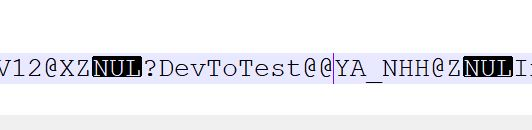
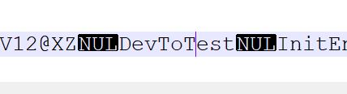

Während in einem 32 Bit projekt inline Assembler benutzt werden kann, gibt es in der X64 Architektur keinen inline Assembler BEfehl mehr. VS unterstützt dies nicht. Stattdessen können die Enter/Leave Callbacks in einer reinen ASM Datei definiert werden. Diese kann dann im Buildprozess mit dem MASM verarbeitet werden.

---> diesen Absatz streichen
# Why not use C++ Code with stdcall convention?
Beim Durcharbeiten des letzten Posts könntest du auf die Idee gekommen sein, statt inline Assembler Code zu nutzen, einfach eine Funktion mit stdcall Konvention zu bauen. Diese würde vor dem "return" den Stack aufräumen. Allerdings ist es so, dass bei der stdcall Konvention vor dem Aufruf der Funktion einige Register gesichert werden und andere müssen vom Aufgerufenen gesichert werden. Die CLR macht jedoch den ersten Schritt nicht. Um nun stdcall zu simulieren, müsste man beim

# Assembler in VS
Um in einem C++ Projekt in VS2019 den MASM zu aktivieren, kann man die [offizielle Anleitung](https://docs.microsoft.com/de-de/cpp/assembler/masm/masm-for-x64-ml64-exe?view=vs-2019) befolgen. Zusätzlich empfehle ich, die VS Erweiterung [AsmDude](https://marketplace.visualstudio.com/items?itemName=Henk-JanLebbink.AsmDude) um Syntaxhighlighting zu erhalten.

Rechtsklick-> eigenschafte -> in 32 bei build ausschließen

# Switching between both implementations
Die in der ASM Dateien definierten Prozeduren können in der C++ Datei angesprochen werden. Dazu muss die Funktion mit `extern "C"` gepräfixt werden. Dies dient dazu, dass der C++ Compiler die Funktionsnamen so belässt wie sie geschrieben sind.

Beispiel:
```cpp
extern bool DevToTest(int a, int b);
```



```cpp
extern "C" bool DevToTest(int a, int b);
```



Um nun abhängig von 32 und 64 Bit unterschiedlichen Code ausführen zu können, bietet es sich an, die Präprozessormakros zu benutzen.
Dazu die `Naked32Bit.h` wie folgt anpassen:

```cpp
#pragma once
#include "pch.h"

#ifdef _WIN64

EXTERN_C void InitEnterLeaveCallbacks(bool* activate, int* hashMap, int size);

EXTERN_C void FnEnterCallback(FunctionID funcId,
  UINT_PTR clientData,
  COR_PRF_FRAME_INFO func,
  COR_PRF_FUNCTION_ARGUMENT_INFO* argumentInfo);

EXTERN_C void FnLeaveCallback(FunctionID funcId,
  UINT_PTR clientData,
  COR_PRF_FRAME_INFO func,
  COR_PRF_FUNCTION_ARGUMENT_INFO* argumentInfo);

EXTERN_C void FnTailcallCallback(FunctionID funcId,
  UINT_PTR clientData,
  COR_PRF_FRAME_INFO func);

#else

void InitEnterLeaveCallbacks(bool* activate, int* hashMap, int size);
//....

#endif
```

Im Falle eines 64 Bit Builds verweisen also die Funktionen auf das Kompilat einer externen Datei. Bitte beachtet, dass ich die Signatur der `Init()` Funktion angepasst habe. Das war notwendig, weil ich in der 64Bit asm Datei auch den Check auf das FLag einbauen möchte. Zudem benötige ich dort auch die HashMap. Um mir den Aufwand zu sparen, die Variablen im ASM definieren zu müssen, übergebe ich einfach die in `CPP` definierten Variablen an die ASM Funktion.

*Hinweis*: Das Naming der Headerdatei passt natürlich nur noch bedingt, aber das soll uns nicht stören :smile:

Die Implementierungsdatei (`Naked32bit.cpp`) muss ebenfalls angepasst werden:

```cpp
extern "C" void _stdcall StackOverflowDetected(FunctionID funcId, int count) {
  std::cout << "stackoverflow: " << funcId << ", count: " << count;
}

extern "C" void _stdcall EnterCpp(
  FunctionID funcId,
  int identifier) {
  std::cout << "enter funcion id: " << funcId << ", Arguments in correct order: " << (identifier == 12345) << "\r\n";
}

#ifdef _WIN64

#else

bool* activateCallbacks;
int* pHashMap;
int mapSize;

void InitEnterLeaveCallbacks(bool* activate, int* hashMap, int size) {
  activateCallbacks = activate;
  pHashMap = hashMap;
  mapSize = size;
}
```

Die beiden Funktionen `EnterCpp` und `SODetected` müssen mit `extern "C"` markiert werden, um die Namen in der ASM Datei verfügbar zu machen. Zudem muss die `Init` Funktion angepasst und die Variablen ebenfalls in den Block für 32Bit Code verschoben werden. Da der komplette notwendige 64Bit Code in der ASM Datei ist, kann der 64Bit Block hier ler bleiben.

Nun fehlt noch die Initialisierung der Callbacks in der `ProfilerCOncreteImpl.cpp`:

```cpp
  this->PHashMap = new int[mapSize];
  memset(this->PHashMap, 0, mapSize);
  InitEnterLeaveCallbacks(&this->ActivateCallbacks, this->PHashMap, mapSize);
```

Die grundlage für die Umschaltung zwischen den Buildprofilen ist gelegt. Nun fehlt noch der Assemblercode.

# The ASM Code
Das Herzstück folgt nun. An sich ist es keine Hexerei. Das einzige, auf was man achten sollte: Es wird nun die FastCall Convention benutzt. Am Ende des Blogposts gibt es ein paar Link, welche sich damit befassen. Das wichtigste, was mir während der Nutzung aufgefallen ist:
- Die Parameter werden von Links nach Rechts in den Register RCX, RDX, R8, R9 übergeben
- Der AUfrufer muss zwingend 4*8 Byte auf dem Stack reservieren, damit der Aufgerufene seine Parameter dorthin sichern könnte
- Der Aufrufer muss den Stack wieder aufräumen

Die letzten zwei Punkte habe ich regelmäßig vergessen, was dann zu unerwünschten, nicht zuordenbaren, Fehlverhalten führte.

```
_DATA SEGMENT
  pActivateEnterLeaveCallback qword 0
  pHashMap qword 0
  mapSize dword 0
_DATA ENDS

extern EnterCpp:proc
extern StackOverflowDetected:proc

_TEXT	SEGMENT

PUBLIC InitEnterLeaveCallbacks

InitEnterLeaveCallbacks PROC
  mov pActivateEnterLeaveCallback, RCX
  mov pHashMap, RDX
  mov mapSize, R8D
  ret
InitEnterLeaveCallbacks ENDP

PUBLIC FnEnterCallback

FnEnterCallback PROC
  mov RAX, pActivateEnterLeaveCallback
  cmp byte ptr [RAX], 1
  JNE skipCallback

  mov R8, pHashMap
  MOV RAX, RCX
  XOR RDX, RDX
  DIV DWORD PTR [mapSize]
  ADD R8, RDX
  INC DWORD PTR [R8]
  CMP DWORD PTR [R8], 30
  JB skipStackOverflow

  xor rdx, rdx
  MOV EDX, [R8]
  SUB RSP, 20h
  CALL StackOverflowDetected
  ADD RSP, 20h

  skipStackOverflow:

  sub RSP, 20h
  mov rdx, 12345
  CALL EnterCpp
  add RSP, 20h

  skipCallback:
  ret
FnEnterCallback ENDP

PUBLIC FnLeaveCallback

FnLeaveCallback PROC
  MOV RAX, pActivateEnterLeaveCallback
  CMP BYTE PTR [RAX], 1
  JNE skipCallback

  MOV R8, pHashMap
  MOV RAX, RCX
  XOR RDX, RDX
  DIV DWORD PTR [mapSize]
  ADD R8, RDX
  DEC DWORD PTR [R8]

  skipCallback:
  ret
FnLeaveCallback ENDP

PUBLIC FnTailcallCallback

FnTailcallCallback PROC
  ret
FnTailcallCallback ENDP

_TEXT	ENDS

END
```

AN sich nichts Neues. Wichtig ist eben `sub RSP, 20h` und `add RSP, 20h`, wie oben bereits erwähnt.

# Using CPP implementations
Da scheinbar von dr CLR beim Aufruf der Callbacks die `fastcall` convention benutzt wird, liegt der Verdacht nahe, dass man auch eine CPP implementierung nutzen könnte. Tatsächlich konnte ich die Callbacks so umsetzen:

```cpp

#ifdef _WIN64
bool* activateCallbacks;
int* pHashMap;
int mapSize;


void InitEnterLeaveCallbacks(bool* activate, int* hashMap, int size) {
  activateCallbacks = activate;
  pHashMap = hashMap;
  mapSize = size;
}

void __fastcall FnEnterCallback(
  FunctionID funcId,
  UINT_PTR clientData,
  COR_PRF_FRAME_INFO func,
  COR_PRF_FUNCTION_ARGUMENT_INFO* argumentInfo) {
  if (activateCallbacks) {
    int amount = pHashMap[funcId % mapSize];
    amount++;
    pHashMap[funcId % mapSize] = amount;

    if (amount >= 30) {
      StackOverflowDetected(funcId, amount);
    }
    EnterCpp(funcId, 12345);
  }
}

void __fastcall FnLeaveCallback(
  FunctionID funcId,
  UINT_PTR clientData,
  COR_PRF_FRAME_INFO func,
  COR_PRF_FUNCTION_ARGUMENT_INFO* argumentInfo) {
  if (activateCallbacks) {
    pHashMap[funcId % mapSize] = pHashMap[funcId % mapSize] - 1;
  }
}

void __fastcall FnTailcallCallback(FunctionID funcId,
  UINT_PTR clientData,
  COR_PRF_FRAME_INFO func) {
}
#else
```

Beim Test konnte ich keine Nachteile feststellen. Ob das allerdings so gewollt ist, kann ich nicht sagen.

# Conclusion
Der Unterschied zwischen 32 und 64 Bit ist nicht sehr groß. AM ehesten sticht die andere Callingconvention hervor. 

# Additional Links
[Configure project in VS to enable MASM](https://docs.microsoft.com/de-de/cpp/assembler/masm/masm-for-x64-ml64-exe?view=vs-2019)
[Use correct #define for x86/x64](https://stackoverflow.com/a/8672915/9809950)
[Impact of fastcall to stack consumption](https://www.viva64.com/en/b/0069/)
[Unwind code macros](https://docs.microsoft.com/de-de/cpp/build/exception-handling-x64?view=vs-2019)
[Stack usage on x64](https://docs.microsoft.com/de-de/cpp/build/stack-usage?view=vs-2019)
[Another link about stack frames](https://www.tortall.net/projects/yasm/manual/html/objfmt-win64-exception.html)
[X64 ASM code for the profiler](http://read.pudn.com/downloads64/sourcecode/windows/system/228104/leave_x64.asm__.htm)
[Example about unwind information](https://docs.microsoft.com/de-de/cpp/assembler/masm/proc?view=vs-2019)
[Explanation of fast call asm code](https://stackoverflow.com/questions/44269811/understanding-fastcall-stack-frame)

----

# Found a typo?
As I am not a native English speaker, it is very likely that you will find an error. In this case, feel free to create a pull request here: https://github.com/gabbersepp/dev.to-posts . Also please open a PR for all other kind of errors.

Do not worry about merge conflicts. I will resolve them on my own. 