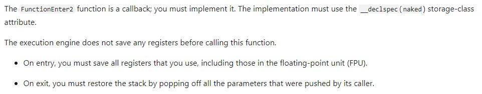

>**Note:** Get the full running example here: [Click me!](https://github.com/gabbersepp/dev.to-posts/tree/master/blog-posts/net-internals/profiler-fn-enter-leave/code/DevToNetProfiler)

The last time I showed some of the callbacks from `ICorProfilerCallback` and how you can obtain more information about the event. This time we want to take a look at the `Function Enter/Leave` callbacks.

# Refactoring
As usual I took the project from the last post in this series. You may notice that I have changed the structure of the files. I moved all of the `virtual` dummy functions, that exists only because of the implementation of the `ICorProfilerCallback2` interface, into an own class. This helps us to keep an overview about what we really want to focus on. Also I made a small fix in the project settings to ensure that both, x32 and x64 builds, are put into the same output directory. This was made to keep the `start.bat` as simple as possible.

# COR_PRF_MONITOR_ENTERLEAVE          
Today we are looking at the `COR_PRF_MONITOR_ENTERLEAVE` option which makes it possible to get notified if a function is entered and left. The callbacks are not declared on the `ICorProfilerCallback` interface but must be [registered](https://docs.microsoft.com/de-de/dotnet/framework/unmanaged-api/profiling/icorprofilerinfo2-setenterleavefunctionhooks2-method) on the `ICorProfilerInfo` object. Use `ICorProfilerInfo.SetEnterLeaveFunctionHooks2` for this task. Please note that the call to this method must occur during `Initialize()`, otherwise it is not valid. Also the callbacks are a bit special in the way you have to implement them :smile:

# Now Assembler comes into play
If we look into the documentation of [FunctionEnter2](https://docs.microsoft.com/de-de/dotnet/framework/unmanaged-api/profiling/functionenter2-function), we can read a inconspicuous paragraph that tells us that:



"`naked`" advices the compiler to neither insert function prologue nor the epilogue at machine code level. The `prologue` consists of a few lines of code that prepares the CPU registers and the stack for the use within the function while the `epilogue` is the counterpart that restores the stack and registers before the function is left. This means, we should write our callbacks using `inline assembler` code. For those who immediately think that under `x64` there is no `inline assembler`: Yes you are right. We will have a look at this in another blog post. In this I want to focus on 32 bit.

Well, how should this assembler code look like? You can, of course, try it on your own. I took a look into the [official Microsoft example](https://github.com/Microsoft/clr-samples/blob/master/ProfilingAPI/ELTProfiler/CorProfiler.cpp#L27) to get a clue how this should work. For the sake of a better overview I put all the inline assembler code into an own file (named `naked32Bit.cpp`).

# Base Assembler Code
The base code is very simple:

```cpp
void __declspec(naked) FnEnterCallback(
  FunctionID funcId,
  UINT_PTR clientData,
  COR_PRF_FRAME_INFO func,
  COR_PRF_FUNCTION_ARGUMENT_INFO* argumentInfo) {
  __asm {
    ret 16
  }
}

void __declspec(naked) FnLeaveCallback(
  FunctionID funcId,
  UINT_PTR clientData,
  COR_PRF_FRAME_INFO func,
  COR_PRF_FUNCTION_ARGUMENT_INFO* argumentInfo) {
  __asm {
    ret 16
  }
}

void __declspec(naked) FnTailcallCallback(FunctionID funcId,
  UINT_PTR clientData,
  COR_PRF_FRAME_INFO func) {
  __asm {
    ret 12
  }
}
```

>**Note:** The meaning of the parameter can be looked up in the documentation. The `TailCallCallback` is nothing I care about here because from what I have read this is not used (at least not very often).

What is the sense of `ret 16`? Well, both callbacks get four arguments passed into by pushing them onto the stack. As already mentioned, there is no epilogue that is capable of removing them from the stack again. So it's on us to clear the stack. Four parameters where each has a size of four bytes results in 16 bytes that must be removed from the stack.

## Accessing the callback's arguments
When pushing function arguments onto the stack, the last parameter in the function definition gets pushed first. Calling the assembler command `CALL` results in another decrease of the stack pointer (SP) because the address of the opcode, that should be executed after the function, is pushed, too. This means that after arriving in the function, the SP must be raised by four bytes, to get the first parameter (was pushed directly before `CALL` occurred). To see this in action, we can create a small console application:

```cpp
#include<iostream>

__declspec(naked) void __stdcall Test(int input, int* output) {
    __asm {
        push EAX
        push EBX
        mov EAX, [ESP + 12] ;input
        mov EBX, [ESP + 16] ;output
        mov [EBX], EAX
        pop EBX
        pop EAX
        ret 12
    }
}

int main()
{
    int output = 0;
    Test(100, &output);
    std::cout << output;
}
```

Please note the **__stdcall**. This means that we clean up the stack on our own, exactly as we would do it in our callbacks. If you omitt this keyword, the compiler applies **cdecl** calling convention, which means that the caller cleans up the stack. `ret 16` would lead to a corrupt stack in this case.

Why do we need **[ESP + 12] to get the first argument**? Well, SP points to the next execution address. In the function we see two `push` commands, which decrease the SP by another 2*4 = 8 bytes. So in the end we have to increase SP by 12 bytes to get the first argument.

By the way: You also would be able to use the names of the function parameters:

```cpp
#include<iostream>

__declspec(naked) void __stdcall Test(int input, int* output) {
    __asm {
        push EBP
        mov EBP, ESP
        push EAX
        push EBX

        mov EAX, input ; <--- variable name
        mov EBX, output
        mov [EBX], EAX

        pop EBX
        pop EAX
        pop EBP
        ret 8
    }
}

int main()
{
    int output = 0;
    Test(100, &output);
    std::cout << output;
}
```

This is working because the compiler assumes where on the stack the arguments are:

```asm
_TEXT	SEGMENT
_input$ = 8						; size = 4
_output$ = 12						; size = 4
?Test@@YGXHPAH@Z PROC					; Test, COMDAT
; 4    :     __asm {
; 5    :         push EBP
  00000	55		 push	 ebp
; 6    :         mov EBP, ESP
  00001	8b ec		 mov	 ebp, esp
; 7    :         push EAX
  00003	50		 push	 eax
; 8    :         push EBX
  00004	53		 push	 ebx
; 9    : 
; 10   :         mov EAX, input
  00005	8b 45 08	 mov	 eax, DWORD PTR _input$[ebp]
```

In line 2 and 3 the position in the stack is defined. We see that "`input`" is accessible by [ESP:8]. I think the compiler assumes that we do a `PUSH EBP` and thus have to use the offset of **8** instead of **4**, but I haven't investigated more about this.

## A very simple approach to reduce the ASM code to as few lines as possible
If you want to reduce the necessary amount of assembler code to a minimum, you can call a C++ function from assembler. Please pay attention which calling convention you choose. To see if all arguments are passed in the right order, I added a second parameter:

```cpp
void _stdcall EnterCpp(
  FunctionID funcId,
  int identifier) {
  std::cout << "enter funcion id: " << funcId << ", Arguments in correct order: " << (identifier == 12345) << "\r\n";
}

void __declspec(naked) FnEnterCallback(
  FunctionID funcId,
  UINT_PTR clientData,
  COR_PRF_FRAME_INFO func,
  COR_PRF_FUNCTION_ARGUMENT_INFO* argumentInfo) {
  __asm {
    ; push last parameter first!
    push 12345
    push [ESP+8]
    call EnterCpp
    ret 16
  }
}
```

## Use more ASM code
I also want to show you an example that makes "heavy" use of Assembler code. Let's say you want to log function enter/leave only sometimes. As you must specify the callbacks during `Initialize()`, you can not completely deactivate the callbacks. So you might come up with the idea to use a flag that can be set from outside during the profiler session.

First we have to introduce a flag. This code should be in the same file where the Assembler code is:

```cpp
bool* activateCallbacks;

void InitEnterLeaveCallbacks(bool* activate) {
  activateCallbacks = activate;
}
```

Then call this function in the `Initialize()`:

```cpp
bool activateCallbacks = false;

HRESULT __stdcall ProfilerConcreteImpl::Initialize(IUnknown* pICorProfilerInfoUnk)
{
  //...
  InitEnterLeaveCallbacks(&activateCallbacks);
  //...
}
```

Now add some simple ASM code that compares the flag's content with `1` ( = true) and if the check fails, it skips the processing of the *function enter* callback:

```cpp
void __declspec(naked) FnEnterCallback(
  FunctionID funcId,
  UINT_PTR clientData,
  COR_PRF_FRAME_INFO func,
  COR_PRF_FUNCTION_ARGUMENT_INFO* argumentInfo) {
  __asm {
    push ebx
    mov ebx, [activateCallbacks]
    cmp byte ptr [ebx], 1
    JNE skipCallback

    ; push last parameter first!
    push 12345
    push [ESP+12]
    call EnterCpp

    skipCallback:
    pop ebx
    ret 16
  }
}
```

**:exclamation:Please note:exclamation:**: By using `EBX` to hold the flag's pointer, we have to increase ESP by another four bytes to get the `FunctionID` parameter.

## Stackoverflow detection
What else could we do with it? Well, in .NET Framework a `StackOverflowException` is the worst case scenario. The application will crash immediately, mostly with no crash dumps available. The enter/leave notifications gives us a possibility to detect a SO, at least it can tell us where one might happen. First we create a integer array which serves as some kind of **HashMap**. It maps a `FunctionID` to the amount of calls to this function:

```cpp
bool* activateCallbacks;
int* hashMap;
const int mapSize = 10000;

void InitEnterLeaveCallbacks(bool* activate) {
  activateCallbacks = activate;
  hashMap = new int[mapSize];
  memset(hashMap, 0, mapSize);
}
```

As the real SO handling will be much more complex (maybe), I call a C++ function if a SO is detected:

```cpp
void _stdcall StackOverflowDetected(FunctionID funcId, int count) {
  std::cout << "stackoverflow: " << funcId << ", count: " << count;
}
```

Extend the already existing code by checking the amount of calls:

```cpp
void __declspec(naked) FnEnterCallback(
  FunctionID funcId,
  UINT_PTR clientData,
  COR_PRF_FRAME_INFO func,
  COR_PRF_FUNCTION_ARGUMENT_INFO* argumentInfo) {
  __asm {
    push ebx
    mov ebx, [activateCallbacks]
    cmp byte ptr[ebx], 1
    JNE skipCallback

    ; check stackoverflow
    mov ebx, [hashMap]
    mov eax, [ESP + 8]
    xor edx, edx
    div dword ptr [mapSize]
    add ebx, edx
    inc dword ptr [ebx]
    cmp dword ptr [ebx], 30
    jb skipStackOverflow

    push [ebx]
    push [ESP + 8]
    CALL StackOverflowDetected

    skipStackOverflow:

    ; push last parameter first!
    push 12345
    push [ESP+12]
    call EnterCpp

    skipCallback:    

    pop ebx
    ret 16
  }
}
```

The code is not hard to understand, I think. By using a modulo operation we calculate the hash of the `FunctionID` and trace the depth of the call. But we also should decrease the amount of calls if the function returns:

```cpp
void __declspec(naked) FnLeaveCallback(
  FunctionID funcId,
  UINT_PTR clientData,
  COR_PRF_FRAME_INFO func,
  COR_PRF_FUNCTION_ARGUMENT_INFO* argumentInfo) {
  __asm {
    push ebx
    mov ebx, [activateCallbacks]
    cmp byte ptr[ebx], 1
    JNE skipCallback

    mov ebx, [hashMap]
    mov eax, [ESP + 8]
    xor edx, edx
    div dword ptr [mapSize]
    add ebx, edx
    dec dword ptr [ebx]

    skipCallback:

    pop ebx
    ret 16
  }
}
```

# Summary
I showed you how you can use the Enter/Leave callbacks on a x86 platform. In the next article we are going to extend this to 64 bit. This differs a bit because there is no inline assembler support for 64 bit platforms. So stay tuned!

# Additional Links
[Official example about how to write Enter/Leave callbacks](https://github.com/Microsoft/clr-samples/blob/master/ProfilingAPI/ELTProfiler/CorProfiler.cpp#L27)
[Another example for Enter/Leave](https://searchcode.com/codesearch/view/777153/)
[Additional ASM Code from MS for X64](https://github.com/microsoftarchive/clrprofiler/blob/master/CLRProfiler/profilerOBJ/amd64/asmhelpers.asm)

----

# Found a typo?
As I am not a native English speaker, it is very likely that you will find an error. In this case, feel free to create a pull request here: https://github.com/gabbersepp/dev.to-posts . Also please open a PR for all other kind of errors.

Do not worry about merge conflicts. I will resolve them on my own. 
