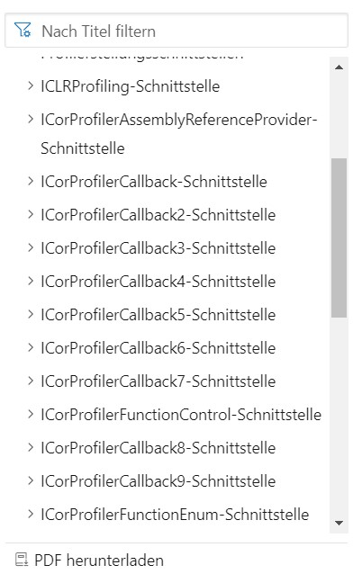
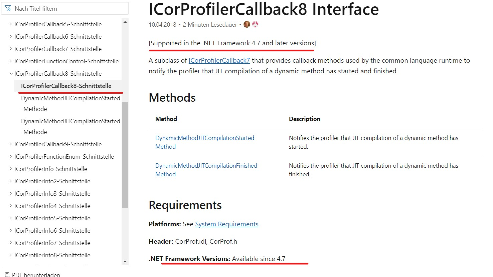
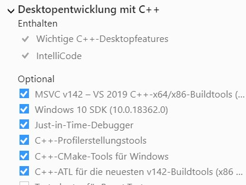
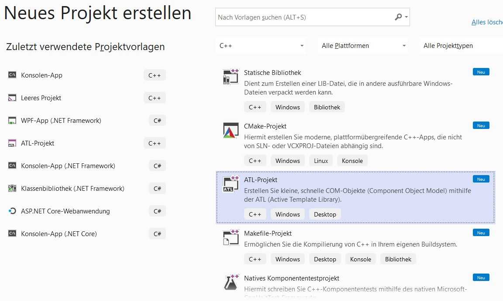
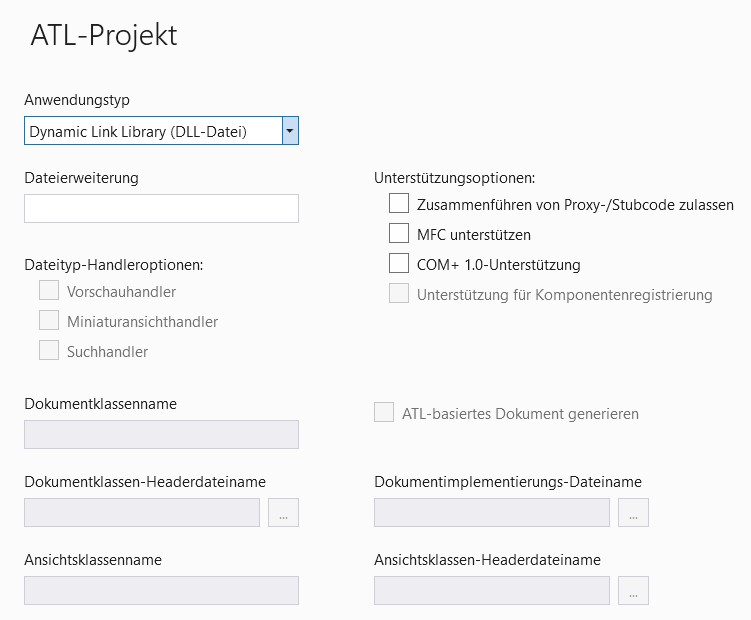
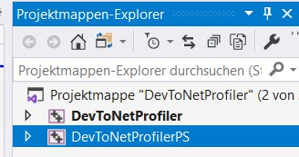
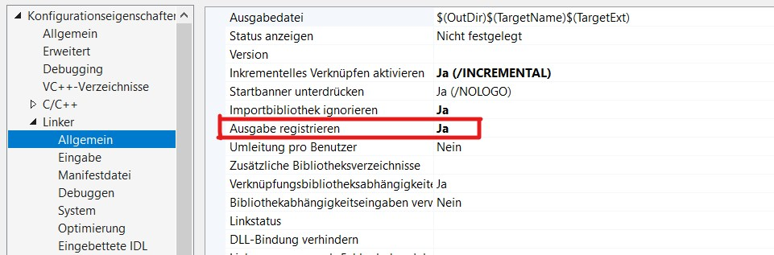
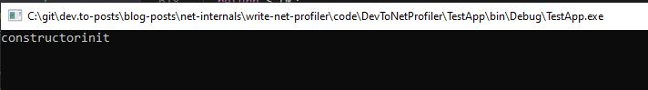
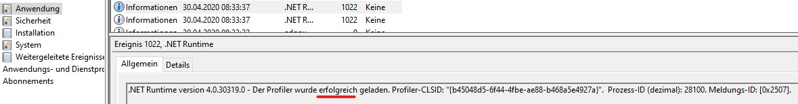

>**[Get the code for this tutorial](https://github.com/gabbersepp/dev.to-posts/tree/master/blog-posts/net-internals/write-net-profiler/code/DevToNetProfiler)**

# .NET Profiling API - What the hell?
If you write an app in C# or VB you normally don't get an exe that contains machine code. Instead the binary is full of `IL` code. This **I**ntermediate **L**anguage is similar to machine code but is built solely for a stack based layout. It does not make any assumptions about the registers. The transformation of `IL Code` to machine code is done by the `CLR` which can be built for every hardware architecture.
Here now come the Profiling API into play. It can hook into several parts of the CLR to notify you if a function is going to be executed or if an exception is thrown and so on.

# ICorProfilerCallback, ICorProfilerInfo, ....
If you reading about that topic you will often read something about a so called `ICorProfilerCallback` interface or a `ICorProfilerInfo` interface. And you also will see those names with a numeric suffix, e.g. `ICorProfilerCallback2`.
The `Profiling API` exists since version 1.x of the framework. Of course Microsoft sometimes added new functionality to those interfaces. So whenever you see a `2` or `3` ... this is a newer version of that interface.

If you want to know if you can use version X for a specific target framework version, you can go to [the Microsoft documentation](https://docs.microsoft.com/de-de/dotnet/framework/unmanaged-api/profiling/icorprofilercallback-interface) and then select the version you are interested in:



For example click onto `ICorProfilerCallback8`. The documentation will tell you which .NET version this interface requires:



# Use cases
OK. Let's talk about some real world use cases. With the `Profiling API` you can:
+ measure the time between `function enter` and `function leave` which enables you to write a CPU profiler to track the total time of every function call
+ notify you about every exception (except `StackOverflow`). Which sometimes may help when exceptions are caught somewhere and not logged
+ maintain the depth of function calls to warn you if a `StackOverflow` may occur
+ rewrite IL code to add functionality to an existing class. This enables you to override things that can't be overwritten in code. Some mocking frameworks use this approach
+ .....

You see, many things you can play with :-)

# The (maybe) bad side
You have to write the profiler with unmanaged code (mostly the people are using C++) because otherwise the profiler itself would trigger profiling events. As far as I know there is no possibility to write a profiler with managed code.

# Some words about ATL
You will see that we use an `ATL` project template. Do not expect some useful information about this kind of project. I just added as much code as required to get a runnable profiler. But you don't need to know any internals about an `ATL` project. Just ignore that stuff.

# Implementing the profiler
Now it's getting dirty! My screenshots are partially in German. But the necessary parts should be clear, though.

## Setup Visual Studio
I am using `Visual Studio 2019` with these components installed:

I am not sure if you need all of them. I just used the default setting of the VS installer.

## Create a project
The first step towards your beautiful profiler is to create a project. Open Visual Studio and create a new project. Choose `ATL`:


Just keep the default settings:


VS creates two projects. Delete the second one whose name ends with `PS`. I don't know what's the purpose of that project. But my profiler compiles without it, too:


Normally the project is configured to get automatically registered in the registry. We do not want this. Also VS will throw an exception if you compile the project without administration rights. So right click onto your project and go to the linker settings. Set **Register output** to **No**:



## Add necessary code
Now we need some extra code to turn this project into a profiler. We go through every file that needs to be touched.

+ **framework.h:** Add `using namespace ATL;` at the end of the file.
+ **Resource.h:** Add `#define IDR_PROFILER	102` somewhere.
+ **DevToNetProfiler.cpp:** Delete the function `STDAPI DllInstall(BOOL bInstall, _In_opt_  LPCWSTR pszCmdLine)`.
+ **DevToNetProfiler.def:** Replace `LIBRARY` with `LIBRARY "DevToNetProfiler.dll"` and remove the line `DllInstall		PRIVATE`
+ **DevToNetProfiler.idl:** replace the whole file with this code:
```cpp
import "oaidl.idl";
import "ocidl.idl";

[
  object,
  uuid(103d660d-1cb4-4410-85dd-67b3aa489626),
  helpstring("INetProfiler Interface"),
  pointer_default(unique)
]
interface INetProfiler : IUnknown {
};
[
  uuid(e0145544-414d-487e-9219-178b87ff0aaa),
  version(1.0),
  helpstring("NetProfiler 1.0 Type Library")
]
library DevToNetProfilerLib
{
  importlib("stdole2.tlb");
  [
    uuid(b45048d5-6f44-4fbe-ae88-b468a5e4927a),
    helpstring("Profiler Class")
  ]
  coclass NetProfiler
  {
    [default] interface IUnknown;
  };
};
```

Now we must implement the ICorProfilerCallback. Don't be afraid. I will come back to this interface later on. **So create a header file `ProfilerCallback.h`** and insert that code:

```cpp
// ./code/DevToNetProfiler/DevToNetProfiler/ProfilerCallback.h

#pragma once

#include "cor.h"
#include "corprof.h"
#include "framework.h"
#include "DevToNetProfiler_i.h"

class ATL_NO_VTABLE ProfilerCallback :
  public CComObjectRootEx<CComSingleThreadModel>,
  public CComCoClass<ProfilerCallback, &CLSID_NetProfiler>,
  public ICorProfilerCallback2
{
public:
  ProfilerCallback();

  DECLARE_REGISTRY_RESOURCEID(IDR_PROFILER)
  BEGIN_COM_MAP(ProfilerCallback)
    COM_INTERFACE_ENTRY(ICorProfilerCallback)
    COM_INTERFACE_ENTRY(ICorProfilerCallback2)
  END_COM_MAP()
  DECLARE_PROTECT_FINAL_CONSTRUCT()

  HRESULT FinalConstruct();
  void FinalRelease();

  // ICorProfilerCallback interface implementation
  virtual HRESULT __stdcall Initialize(IUnknown* pICorProfilerInfoUnk);
  virtual HRESULT __stdcall Shutdown();
  virtual HRESULT __stdcall AppDomainCreationStarted(AppDomainID appDomainID);
  virtual HRESULT __stdcall AppDomainCreationFinished(AppDomainID appDomainID, HRESULT hrStatus);
  virtual HRESULT __stdcall AppDomainShutdownStarted(AppDomainID appDomainID);
  virtual HRESULT __stdcall AppDomainShutdownFinished(AppDomainID appDomainID, HRESULT hrStatus);
  virtual HRESULT __stdcall AssemblyLoadStarted(AssemblyID assemblyID);
  virtual HRESULT __stdcall AssemblyLoadFinished(AssemblyID assemblyID, HRESULT hrStatus);
  virtual HRESULT __stdcall AssemblyUnloadStarted(AssemblyID assemblyID);
  virtual HRESULT __stdcall AssemblyUnloadFinished(AssemblyID assemblyID, HRESULT hrStatus);
  virtual HRESULT __stdcall ModuleLoadStarted(ModuleID moduleID);
  virtual HRESULT __stdcall ModuleLoadFinished(ModuleID moduleID, HRESULT hrStatus);
  virtual HRESULT __stdcall ModuleUnloadStarted(ModuleID moduleID);
  virtual HRESULT __stdcall ModuleUnloadFinished(ModuleID moduleID, HRESULT hrStatus);
  virtual HRESULT __stdcall ModuleAttachedToAssembly(ModuleID moduleID, AssemblyID assemblyID);
  virtual HRESULT __stdcall ClassLoadStarted(ClassID classID);
  virtual HRESULT __stdcall ClassLoadFinished(ClassID classID, HRESULT hrStatus);
  virtual HRESULT __stdcall ClassUnloadStarted(ClassID classID);
  virtual HRESULT __stdcall ClassUnloadFinished(ClassID classID, HRESULT hrStatus);
  virtual HRESULT __stdcall FunctionUnloadStarted(FunctionID functionID);
  virtual HRESULT __stdcall JITCompilationStarted(FunctionID functionID, BOOL fIsSafeToBlock);
  virtual HRESULT __stdcall JITCompilationFinished(FunctionID functionID, HRESULT hrStatus, BOOL fIsSafeToBlock);
  virtual HRESULT __stdcall JITCachedFunctionSearchStarted(FunctionID functionID, BOOL* pbUseCachedFunction);
  virtual HRESULT __stdcall JITCachedFunctionSearchFinished(FunctionID functionID, COR_PRF_JIT_CACHE result);
  virtual HRESULT __stdcall JITFunctionPitched(FunctionID functionID);
  virtual HRESULT __stdcall JITInlining(FunctionID callerID, FunctionID calleeID, BOOL* pfShouldInline);
  virtual HRESULT __stdcall ThreadCreated(ThreadID threadID);
  virtual HRESULT __stdcall ThreadDestroyed(ThreadID threadID);
  virtual HRESULT __stdcall ThreadAssignedToOSThread(ThreadID managedThreadID, DWORD osThreadID);
  virtual HRESULT __stdcall RemotingClientInvocationStarted();
  virtual HRESULT __stdcall RemotingClientSendingMessage(GUID* pCookie, BOOL fIsAsync);
  virtual HRESULT __stdcall RemotingClientReceivingReply(GUID* pCookie, BOOL fIsAsync);
  virtual HRESULT __stdcall RemotingClientInvocationFinished();
  virtual HRESULT __stdcall RemotingServerReceivingMessage(GUID* pCookie, BOOL fIsAsync);
  virtual HRESULT __stdcall RemotingServerInvocationStarted();
  virtual HRESULT __stdcall RemotingServerInvocationReturned();
  virtual HRESULT __stdcall RemotingServerSendingReply(GUID* pCookie, BOOL fIsAsync);
  virtual HRESULT __stdcall UnmanagedToManagedTransition(FunctionID functionID, COR_PRF_TRANSITION_REASON reason);
  virtual HRESULT __stdcall ManagedToUnmanagedTransition(FunctionID functionID, COR_PRF_TRANSITION_REASON reason);
  virtual HRESULT __stdcall RuntimeSuspendStarted(COR_PRF_SUSPEND_REASON suspendReason);
  virtual HRESULT __stdcall RuntimeSuspendFinished();
  virtual HRESULT __stdcall RuntimeSuspendAborted();
  virtual HRESULT __stdcall RuntimeResumeStarted();
  virtual HRESULT __stdcall RuntimeResumeFinished();
  virtual HRESULT __stdcall RuntimeThreadSuspended(ThreadID threadid);
  virtual HRESULT __stdcall RuntimeThreadResumed(ThreadID threadid);
  virtual HRESULT __stdcall MovedReferences(ULONG cmovedObjectIDRanges, ObjectID oldObjectIDRangeStart[], ObjectID newObjectIDRangeStart[], ULONG cObjectIDRangeLength[]);
  virtual HRESULT __stdcall ObjectAllocated(ObjectID objectID, ClassID classID);
  virtual HRESULT __stdcall ObjectsAllocatedByClass(ULONG classCount, ClassID classIDs[], ULONG objects[]);
  virtual HRESULT __stdcall ObjectReferences(ObjectID objectID, ClassID classID, ULONG cObjectRefs, ObjectID objectRefIDs[]);
  virtual HRESULT __stdcall RootReferences(ULONG cRootRefs, ObjectID rootRefIDs[]);
  virtual HRESULT __stdcall ExceptionThrown(ObjectID thrownObjectID);
  virtual HRESULT __stdcall ExceptionSearchFunctionEnter(FunctionID functionID);
  virtual HRESULT __stdcall ExceptionSearchFunctionLeave();
  virtual HRESULT __stdcall ExceptionSearchFilterEnter(FunctionID functionID);
  virtual HRESULT __stdcall ExceptionSearchFilterLeave();
  virtual HRESULT __stdcall ExceptionSearchCatcherFound(FunctionID functionID);
  virtual HRESULT __stdcall ExceptionCLRCatcherFound();
  virtual HRESULT __stdcall ExceptionCLRCatcherExecute();
  virtual HRESULT __stdcall ExceptionOSHandlerEnter(FunctionID functionID);
  virtual HRESULT __stdcall ExceptionOSHandlerLeave(FunctionID functionID);
  virtual HRESULT __stdcall ExceptionUnwindFunctionEnter(FunctionID functionID);
  virtual HRESULT __stdcall ExceptionUnwindFunctionLeave();
  virtual HRESULT __stdcall ExceptionUnwindFinallyEnter(FunctionID functionID);
  virtual HRESULT __stdcall ExceptionUnwindFinallyLeave();
  virtual HRESULT __stdcall ExceptionCatcherEnter(FunctionID functionID, ObjectID objectID);
  virtual HRESULT __stdcall ExceptionCatcherLeave();
  virtual HRESULT __stdcall COMClassicVTableCreated(ClassID wrappedClassID, REFGUID implementedIID, void* pVTable, ULONG cSlots);
  virtual HRESULT __stdcall COMClassicVTableDestroyed(ClassID wrappedClassID, REFGUID implementedIID, void* pVTable);

  // ICorProfilerCallback2 interface implementation
  virtual HRESULT __stdcall ThreadNameChanged(ThreadID threadId, ULONG cchName, WCHAR name[]);
  virtual HRESULT __stdcall GarbageCollectionStarted(int cGenerations, BOOL generationCollected[], COR_PRF_GC_REASON reason);
  virtual HRESULT __stdcall SurvivingReferences(ULONG cSurvivingObjectIDRanges, ObjectID objectIDRangeStart[], ULONG cObjectIDRangeLength[]);
  virtual HRESULT __stdcall GarbageCollectionFinished();
  virtual HRESULT __stdcall FinalizeableObjectQueued(DWORD finalizerFlags, ObjectID objectID);
  virtual HRESULT __stdcall RootReferences2(ULONG cRootRefs, ObjectID rootRefIds[], COR_PRF_GC_ROOT_KIND rootKinds[], COR_PRF_GC_ROOT_FLAGS rootFlags[], UINT_PTR rootIds[]);
  virtual HRESULT __stdcall HandleCreated(GCHandleID handleId, ObjectID initialObjectId);
  virtual HRESULT __stdcall HandleDestroyed(GCHandleID handleId);
};

OBJECT_ENTRY_AUTO(__uuidof(NetProfiler), ProfilerCallback)

```

VS will now warn you that it can't find `CLSID_Netprofiler`. To fix this, compile the project. This will generate two files (`DevToNetProfiler_i.c` and `DevToNetProfiler_i.h`). The first now contains the CLSID. 
Note the usage of `ICorProfilerCallback2` here. I tried to use only the first version of the interface but it failed. I was not able to attach it to any process. Maybe `ICorProfilerCallback` is too old for the current .NET framework versions. 

**Create `ProfilerCallback.cpp`** and add following content:
```cpp
// ./code/DevToNetProfiler/DevToNetProfiler/ProfilerCallback.cpp

#include "pch.h"
#include "ProfilerCallback.h"
#include<iostream>

ProfilerCallback::ProfilerCallback() {
  std::cout << "constructor";
}

HRESULT ProfilerCallback::FinalConstruct()
{
  return S_OK;
}

void ProfilerCallback::FinalRelease()
{
}

HRESULT __stdcall ProfilerCallback::Initialize(IUnknown* pICorProfilerInfoUnk)
{
  std::cout << "init";
  return S_OK;
}

HRESULT __stdcall ProfilerCallback::Shutdown()
{
  return S_OK;
}

HRESULT __stdcall ProfilerCallback::AppDomainCreationStarted(AppDomainID appDomainID)
{
  return S_OK;
}

HRESULT __stdcall ProfilerCallback::AppDomainCreationFinished(AppDomainID appDomainID, HRESULT hrStatus)
{
  return S_OK;
}

HRESULT __stdcall ProfilerCallback::AppDomainShutdownStarted(AppDomainID appDomainID)
{
  return S_OK;
}

HRESULT __stdcall ProfilerCallback::AppDomainShutdownFinished(AppDomainID appDomainID, HRESULT hrStatus)
{
  return S_OK;
}

HRESULT __stdcall ProfilerCallback::AssemblyLoadStarted(AssemblyID assemblyID)
{
  return S_OK;
}

HRESULT __stdcall ProfilerCallback::AssemblyLoadFinished(AssemblyID assemblyID, HRESULT hrStatus)
{
  return S_OK;
}

HRESULT __stdcall ProfilerCallback::AssemblyUnloadStarted(AssemblyID assemblyID)
{
  return S_OK;
}

HRESULT __stdcall ProfilerCallback::AssemblyUnloadFinished(AssemblyID assemblyID, HRESULT hrStatus)
{
  return S_OK;
}

HRESULT __stdcall ProfilerCallback::ModuleLoadStarted(ModuleID moduleID)
{
  return S_OK;
}

HRESULT __stdcall ProfilerCallback::ModuleLoadFinished(ModuleID moduleID, HRESULT hrStatus)
{
  return S_OK;
}

HRESULT __stdcall ProfilerCallback::ModuleUnloadStarted(ModuleID moduleID)
{
  return S_OK;
}

HRESULT __stdcall ProfilerCallback::ModuleUnloadFinished(ModuleID moduleID, HRESULT hrStatus)
{
  return S_OK;
}

HRESULT __stdcall ProfilerCallback::ModuleAttachedToAssembly(ModuleID moduleID, AssemblyID assemblyID)
{
  return S_OK;
}

HRESULT __stdcall ProfilerCallback::ClassLoadStarted(ClassID classID)
{
  return S_OK;
}

HRESULT __stdcall ProfilerCallback::ClassLoadFinished(ClassID classID, HRESULT hrStatus)
{
  return S_OK;
}

HRESULT __stdcall ProfilerCallback::ClassUnloadStarted(ClassID classID)
{
  return S_OK;
}

HRESULT __stdcall ProfilerCallback::ClassUnloadFinished(ClassID classID, HRESULT hrStatus)
{
  return S_OK;
}

HRESULT __stdcall ProfilerCallback::FunctionUnloadStarted(FunctionID functionID)
{
  return S_OK;
}

HRESULT __stdcall ProfilerCallback::JITCompilationStarted(FunctionID functionID, BOOL fIsSafeToBlock)
{
  return S_OK;
}

HRESULT __stdcall ProfilerCallback::JITCompilationFinished(FunctionID functionID, HRESULT hrStatus, BOOL fIsSafeToBlock)
{
  return S_OK;
}

HRESULT __stdcall ProfilerCallback::JITCachedFunctionSearchStarted(FunctionID functionID, BOOL* pbUseCachedFunction)
{
  return S_OK;
}

HRESULT __stdcall ProfilerCallback::JITCachedFunctionSearchFinished(FunctionID functionID, COR_PRF_JIT_CACHE result)
{
  return S_OK;
}

HRESULT __stdcall ProfilerCallback::JITFunctionPitched(FunctionID functionID)
{
  return S_OK;
}

HRESULT __stdcall ProfilerCallback::JITInlining(FunctionID callerID, FunctionID calleeID, BOOL* pfShouldInline)
{
  return S_OK;
}

HRESULT __stdcall ProfilerCallback::UnmanagedToManagedTransition(FunctionID functionID, COR_PRF_TRANSITION_REASON reason)
{
  return S_OK;
}

HRESULT __stdcall ProfilerCallback::ManagedToUnmanagedTransition(FunctionID functionID, COR_PRF_TRANSITION_REASON reason)
{
  return S_OK;
}

HRESULT __stdcall ProfilerCallback::ThreadCreated(ThreadID threadID)
{
  return S_OK;
}

HRESULT __stdcall ProfilerCallback::ThreadDestroyed(ThreadID threadID)
{
  return S_OK;
}

HRESULT __stdcall ProfilerCallback::ThreadAssignedToOSThread(ThreadID managedThreadID, DWORD osThreadID)
{
  return S_OK;
}

HRESULT __stdcall ProfilerCallback::RemotingClientInvocationStarted()
{
  return S_OK;
}

HRESULT __stdcall ProfilerCallback::RemotingClientSendingMessage(GUID* pCookie, BOOL fIsAsync)
{
  return S_OK;
}

HRESULT __stdcall ProfilerCallback::RemotingClientReceivingReply(GUID* pCookie, BOOL fIsAsync)
{
  return S_OK;
}

HRESULT __stdcall ProfilerCallback::RemotingClientInvocationFinished()
{
  return S_OK;
}

HRESULT __stdcall ProfilerCallback::RemotingServerReceivingMessage(GUID* pCookie, BOOL fIsAsync)
{
  return S_OK;
}

HRESULT __stdcall ProfilerCallback::RemotingServerInvocationStarted()
{
  return S_OK;
}

HRESULT __stdcall ProfilerCallback::RemotingServerInvocationReturned()
{
  return S_OK;
}

HRESULT __stdcall ProfilerCallback::RemotingServerSendingReply(GUID* pCookie, BOOL fIsAsync)
{
  return S_OK;
}

HRESULT __stdcall ProfilerCallback::RuntimeSuspendStarted(COR_PRF_SUSPEND_REASON suspendReason)
{
  return S_OK;
}

HRESULT __stdcall ProfilerCallback::RuntimeSuspendFinished()
{
  return S_OK;
}

HRESULT __stdcall ProfilerCallback::RuntimeSuspendAborted()
{
  return S_OK;
}

HRESULT __stdcall ProfilerCallback::RuntimeResumeStarted()
{
  return S_OK;
}

HRESULT __stdcall ProfilerCallback::RuntimeResumeFinished()
{
  return S_OK;
}

HRESULT __stdcall ProfilerCallback::RuntimeThreadSuspended(ThreadID threadID)
{
  return S_OK;
}

HRESULT __stdcall ProfilerCallback::RuntimeThreadResumed(ThreadID threadID)
{
  return S_OK;
}

HRESULT __stdcall ProfilerCallback::MovedReferences(ULONG cmovedObjectIDRanges, ObjectID oldObjectIDRangeStart[], ObjectID newObjectIDRangeStart[], ULONG cObjectIDRangeLength[])
{
  return S_OK;
}

HRESULT __stdcall ProfilerCallback::ObjectAllocated(ObjectID objectID, ClassID classID)
{
  return S_OK;
}

HRESULT __stdcall ProfilerCallback::ObjectsAllocatedByClass(ULONG classCount, ClassID classIDs[], ULONG objects[])
{
  return S_OK;
}

HRESULT __stdcall ProfilerCallback::ObjectReferences(ObjectID objectID, ClassID classID, ULONG objectRefs, ObjectID objectRefIDs[])
{
  return S_OK;
}

HRESULT __stdcall ProfilerCallback::RootReferences(ULONG rootRefs, ObjectID rootRefIDs[])
{
  return S_OK;
}

HRESULT __stdcall ProfilerCallback::ExceptionThrown(ObjectID thrownObjectID)
{
  return S_OK;
}

HRESULT __stdcall ProfilerCallback::ExceptionUnwindFunctionEnter(FunctionID functionID)
{
  return S_OK;
}

HRESULT __stdcall ProfilerCallback::ExceptionUnwindFunctionLeave()
{
  return S_OK;
}

HRESULT __stdcall ProfilerCallback::ExceptionSearchFunctionEnter(FunctionID functionID)
{
  return S_OK;
}

HRESULT __stdcall ProfilerCallback::ExceptionSearchFunctionLeave()
{
  return S_OK;
}

HRESULT __stdcall ProfilerCallback::ExceptionSearchFilterEnter(FunctionID functionID)
{
  return S_OK;
}

HRESULT __stdcall ProfilerCallback::ExceptionSearchFilterLeave()
{
  return S_OK;
}

HRESULT __stdcall ProfilerCallback::ExceptionSearchCatcherFound(FunctionID functionID)
{
  return S_OK;
}

HRESULT __stdcall ProfilerCallback::ExceptionCLRCatcherFound()
{
  return S_OK;
}

HRESULT __stdcall ProfilerCallback::ExceptionCLRCatcherExecute()
{
  return S_OK;
}

HRESULT __stdcall ProfilerCallback::ExceptionOSHandlerEnter(FunctionID functionID)
{
  return S_OK;
}

HRESULT __stdcall ProfilerCallback::ExceptionOSHandlerLeave(FunctionID functionID)
{
  return S_OK;
}

HRESULT __stdcall ProfilerCallback::ExceptionUnwindFinallyEnter(FunctionID functionID)
{
  return S_OK;
}

HRESULT __stdcall ProfilerCallback::ExceptionUnwindFinallyLeave()
{
  return S_OK;
}

HRESULT __stdcall ProfilerCallback::ExceptionCatcherEnter(FunctionID functionID,
  ObjectID objectID)
{
  return S_OK;
}

HRESULT __stdcall ProfilerCallback::ExceptionCatcherLeave()
{
  return S_OK;
}

HRESULT __stdcall ProfilerCallback::COMClassicVTableCreated(ClassID wrappedClassID, REFGUID implementedIID, void* pVTable, ULONG cSlots)
{
  return S_OK;
}

HRESULT __stdcall ProfilerCallback::COMClassicVTableDestroyed(ClassID wrappedClassID, REFGUID implementedIID, void* pVTable)
{
  return S_OK;
}

HRESULT __stdcall ProfilerCallback::ThreadNameChanged(ThreadID threadID, ULONG cchName, WCHAR name[])
{
  return S_OK;
}

HRESULT __stdcall ProfilerCallback::GarbageCollectionStarted(int cGenerations, BOOL generationCollected[], COR_PRF_GC_REASON reason)
{
  return S_OK;
}

HRESULT __stdcall ProfilerCallback::SurvivingReferences(ULONG cSurvivingObjectIDRanges, ObjectID objectIDRangeStart[], ULONG cObjectIDRangeLength[])
{
  return S_OK;
}

HRESULT __stdcall ProfilerCallback::GarbageCollectionFinished()
{
  return S_OK;
}

HRESULT __stdcall ProfilerCallback::FinalizeableObjectQueued(DWORD finalizerFlags, ObjectID objectID)
{
  return S_OK;
}

HRESULT __stdcall ProfilerCallback::RootReferences2(ULONG cRootRefs, ObjectID rootRefIDs[], COR_PRF_GC_ROOT_KIND rootKinds[], COR_PRF_GC_ROOT_FLAGS rootFlags[], UINT_PTR rootIDs[])
{
  return S_OK;
}

HRESULT __stdcall ProfilerCallback::HandleCreated(GCHandleID handleID, ObjectID initialObjectID)
{
  return S_OK;
}

HRESULT __stdcall ProfilerCallback::HandleDestroyed(GCHandleID handleID)
{
  return S_OK;
}


```

Please note both `cout` statements within `Initialize` and the `constructor`. We should see those strings if the profiler was loaded successfully.

## Create C# test app
Now add a simple C# console app and add `Console.Read()` to keep the console open.

## Starting the app and loading the profiler
How does .NET know that it must load the profiler? Well you can register it globally in the registry. But I do not recommend that. Instead, use those four environment variables:

```
SET COR_ENABLE_PROFILING=1
SET COR_PROFILER={b45048d5-6f44-4fbe-ae88-b468a5e4927a}
SET COR_PROFILER_PATH=Debug/DevToNetProfiler.dll
SET COMPLUS_ProfAPI_ProfilerCompatibilitySetting=EnableV2Profiler

START TestApp/bin/Debug/TestApp.exe
```

The first activates profiling, the second one passes the profiler ID. You can find it in the file `DevToNetProfiler.idl`. The third enables you to use `ICorProfilerCallback2` with .NET4. If you use the newest interface versions, that environment variable can be omitted. Save those lines as `start.bat` in the project root, execute it and you should get this result:


Also you can check the windows event log:




## A word about those many methods
Don't be worried about those many functions. You just have to implement the interface thus you need to add those stubs here. Just ignore all of them that you do not need.

# Summary
OK. This was a lot of code. I will stop here and write another article for this series to keep the single posts very small. What have done so far? We created a profiler with just a minimum set of functionality. You can use this *template* from now on. I will also refer to it in the following articles.
And again: Don't think about those ATL things. They are completely irrelevant.

I see you in the next blog post when we are discussing how the profiler works.

If you haven't seen the download link yet: [The full runnable example is here](https://github.com/gabbersepp/dev.to-posts/tree/master/blog-posts/net-internals/write-net-profiler/code/DevToNetProfiler)

----

# Found a typo?
As I am not a native English speaker, it is very likely that you will find an error. In this case, feel free to create a pull request here: https://github.com/gabbersepp/dev.to-posts . Also please open a PR for all other kind of errors.

Do not worry about merge conflicts. I will resolve them on my own. 
