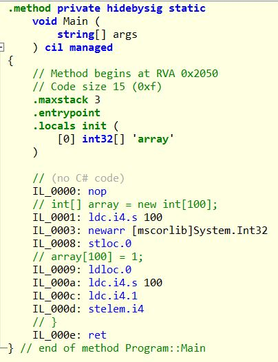
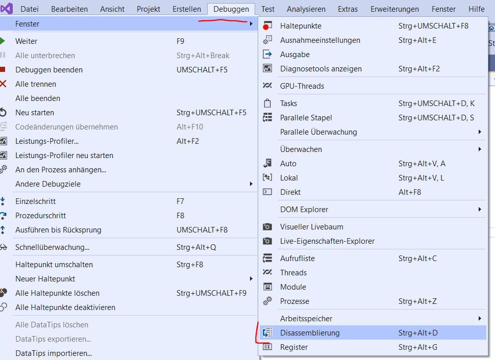
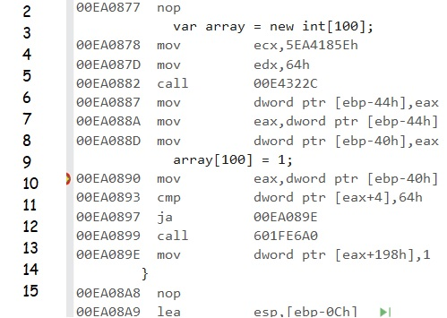
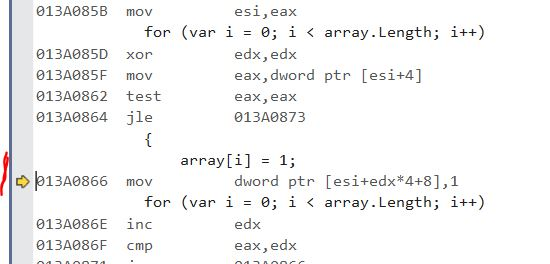

Today I came across a performance issue in our `.net` app which utilizes an algorithm with runtime `O(n^3)`. One step to fix this issue was to avoid implicit array bound checks. I will focus on that topic here.

>**Note:** If you don't know the term `O(x)` I recommend you to read TODO

# Some introduction blabla

`O(n^3)` is not a problem as long as `n` is small enough. And in all cases until now this was true. But now `n` equals about 2000. Because it is not expected that this quantity will also occur in our production system, I will not try to optimize the algorithm but only reduce the amount of operations it does.

>**Note:** In my opinion no one should perform performance optimization just because it is possible. Highly optimized algorithms maybe require more time to understand for new developers, maybe they need more time to maintain if a customer reports a bug. It should always be weighed well.

Here a bug in an API test created this amount of data. Our QA then triggered the algorithm manually and BOOM. So not critical but annoying for our QA.

# What was the algorithm doing

The part of the algorithm I focus on is doing a simple thing like assigning an integer to a specific position in an array. And this is done, you guess right, about 2000^3 times in the worst case. Well, that are quite a few operations!

```cs
// code/algorithm.cs

var n = 2000;
var array = new int[2000];
for(var a = 0; a < 2000; a++) {
    for(var b = 0; b < 2000; b++) {
        for(var c = 0; c < 2000; c++) {
            array[....] = xyz;
        }
    }
}
```

Of course this is silly. We do a bit more. But as already said, FOCUS!

# What accessing an array means in .NET
Do you know the good old times in `Assembler` where you can access an array with pure pointer arithmetic? Unfortunately, my time producing high quality `asm` code is long gone otherwise I would have been able to provide you an example ;-P

But let me tell you: You where responsible for not accessing data outside your `array`. In `csharp` you may use something like this:

```cs
static void Main(string[] args)
{
    var array = new int[100];
    array[100] = 1;
}
```

You all know what will happen here! We get an `IndexOutOfRangeException`! But what will happen if we do some dirty stuff like this:

```cs
var array = new int[10];
unsafe
{
    fixed (int* ptr = &array[0])
    {
        ptr[10] = 1;
    }
}
```

Guess what? No exception! Your program crashes.

**Conclusion:** Getting an exception during accessing an array the good old way in csharp and seeing the program dying when using dirty shit means: `.NET` is doing implicit array bound checks. And this is what this article is about. I want to show you how you can see what your code really does and if it makes a difference if we disable those checks.

# Analyzing what is going on

Basically there are two steps when executing `csharp` code:
+ Compiling everything into `IL` code
+ Producing real machine code

The first step generates some cross platform machine code that is based upon a stack layout. The JIT compiler does not know where your executable is going to be executed. So it makes as less assumptions as possible. 

I often use `ILSpy`, a free extension for Visual Studio, that can show you the IL code. Let's load the `.exe` of the first example into that extension and generate the IL code:



Take a deep breath and let that work on you! Look at line `IL_00d`. The opcode `stelem` is called which will place the integer `1` into the array at position `100`. You may notice that there is nothing that looks like a call to an exception. So this representation is not enough. We must go one tier deeper to see, what's really going on here.

# Getting the ASM code of a .NET application/dll

We are going to analyze the ASM code. If .NET makes bounds checks, then they must be visible there. Place a breakpoint in the line `array[100] = 1;` and start debugging. When the debugger breaks, go to `Debugging > Window > Disassembling":



A new window opens with this content:



+ **Line 4**: `0x64` = `100` is loaded into the register EDX
+ **Line 5**: It will be the parameter for the call of `0x00E4322C` which should be the creation of a new array. 
+ **Line 6 - 8**: The array's pointer seems to be in register `EAX`. I guess that `0x00E4322C` places the pointer to the new memory into `EAX`. `[ebp+0x40]` should be the address of the variable `array`. `EAX` is copied there.
+ **Line 10**: The pointer to the array is loaded into `EAX`
+ **Line 11**: Something is compared (`cmp`) against 100
+ **Line 12**: `ja` means `jump if above`. If the value in `ptr [eax + 4]` is above 100, jump to Line 13 and place the value `1` into the array

**ptr [eax+4]**:

`EAX` points to the beginning of the array in the memory. Now there are not just integers in the array. Every managed object in `.NET` also has some metadata that describe the object. And at `[eax+4]`, you probably can tell already, you find the size of the array. **Line 11** compares the array size with 100 (the specified index where a value should placed into) and if it is above, the execution continues. If not, **Line 13** is called which will be the `IndexOutOfRange` exception.

# Checking another example

The JIT compiler tries to avoid this check where possible. Take a look at this example:

```cs
var array = new int[100];
for (var i = 0; i < array.Length; i++)
{
    array[i] = 1;
}
```

To get a meaningful ASM output, you should run the program in release mode. Just select the `Release` profile and start Debugging. VS will ask you if you want to continue debugging a release build. Use the option `Deactivate 'Only own code' and continue debugging`. If you execute this code in debug mode, you will find the bounds check again. And what do we find in Release mode?



No check of the array bounds anymore. This was omitted by the runtime because it knows that `i` can never be larger than the array`s size.

# Impact of branch prediction

Maybe you have heard about branch predictions in modern CPU architectures. 

Consider this example:

```cs
for(var i = 0; i < 1000000; i++)
{
    if (i > DateTimeOffset.UtcNow.Ticks)
    {
        throw new Exception();
    }
}
```

The part within the `if` will never be executed. We know this but the CPU does not. But after a few iterations, the CPU understands the pattern and assumes, that the condition will never be true. So it will load the next instructions into memory under the assumption that `i is greater or equal 1000.000`. If the evaluation of the condition equals true, the memory has to be cleared and the instructions within the `if` have to be loaded.

Branch prediction will save time if a condition often yields the same value by preloading the next most likely instructions.

This maybe is enough to reduce the extra amount if time that is needed for the array bounds checks.

----

# Found a typo?
As I am not a native English speaker, it is very likely that you will find an error. In this case, feel free to create a pull request here: https://github.com/gabbersepp/dev.to-posts . Also please open a PR for all other kind of errors.

Do not worry about merge conflicts. I will resolve them on my own. 