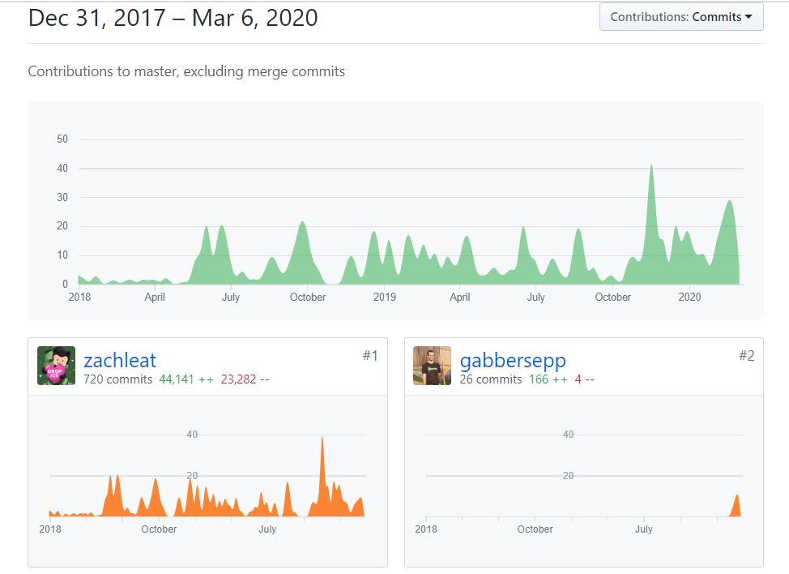

During the last three weeks I made 29 pull requests in the repository of [https://github.com/11ty/11ty-website](https://github.com/11ty/11ty-website):



I also read through many issues and added a comment if I was sure that the issue can be closed. A collegue of mine asked me why I am doing this. He would not want to spend time for that because he had so much other own projects to maintain.

# Please support your favorite open source projects

I tried `11ty` about four or six weeks ago and I falled in love at the first sight. It is so easy to use with so many possibilities. Currently I have build two websites with eleventy. 

My personal portfolio page where I agregate everything I do into one place:



And a german page that publishes cartoons with developer background:



The owner of that repository invested many time into this neat tool and into the documentation also. And all that stuff helped me a lot. I am happy to be able to give something back to the owner and I ask you to do the same with your favorite open source project. Every line of code helps.

In this case the only thing I have done was to add new JSON files like that one:

```json
{
	"url": "https://kack.dev",
	"name": "KackDev",
	"description": "Cartoons from the life of a developer.",
	"twitter": "KackDev",
	"source_url": "https://github.com/gabbersepp/kack_dev"
}
```

They are used to build the list of pages that are [built with eleventy](https://www.11ty.dev/docs/sites/). There were about 50 issues that aimed to add a new site. About 20 issues were obsolete because the site they are about have been added i former committs. And for the remaining 30 issues I have created pull requests.

You may think that this is some kind of stupid work with no intellectual claim. And you are right. But there is one fact that counts: **It costs time to implement all those issues**.

Time the owner maybe does not have. So if you have some time and you see some issues that you can solve, please try it.

What do you think? How much time do you spend at open source projects?

----

# Found a typo?
As I am not a native English speaker, it is very likely that you will find an error. In this case, feel free to create a pull request here: https://github.com/gabbersepp/dev.to-posts . Also please open a PR for all other kind of errors.

Do not worry about merge conflicts. I will resolve them on my own. 
