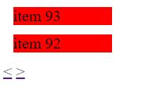
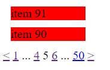

In the last blog post I introduced you into the power of `eleventy`'s pagination feature. I also gave you a very simple navigation. It looked like this:



But wouldn't it be nice if it looks like this:



The advantages are obvious:
+ you easily can jump to the first and last page
+ you see how many pages exist
+ you must not display the whole navigation bar with all pages
+ you have the page before the current and the page after the current in the navigation bar which looks a bit better than without it

As in the most cases, I use a `nunjucks` template for this example. But you can apply this approach in other engines, too.

# Pagination's properties

When you declare a pagination in the frontmatter, `eleventy` makes a variable named `pagination` available in your template. Amongst other things you have access to those properties:

```json
{
  "items": "the sliced window containing only the subset of the whole data set",
  "href": {
    "previous": "url of the previous page",
    "next": "url of the next page"
  },
  "pages": "",
  "hrefs": "array with all URL's of this pagination"
}
```

When iterating over a set of data, you probably do this by:

```
  
```

Within the loop scope you have access to a variable named `loop` with following properties:

```json
{
  "index": "current 1-based index",
  "index0": "current 0-based index"
}
```

That are all properties that we need to create a fancy pagination.

# Show arrows for `previous` and `next` page
We have done this in the former blog post. You just have to check if a previous and next page exist:

<!-- embedme project/views/index.njk#L12-L14 -->
```html

    <span><a href="{{ pagination.href.previous }}">&lt;</a></span>

```

<!-- embedme project/views/index.njk#L33-L35 -->
```html

```

# Iterating through all possible pages

`pagination.hrefs` contains an array with strings, representing a URL each.

<!-- embedme project/views/index.njk#L18-L18 -->
```html

```

# Print the current page not as link
The current page should be specially marked so everyone intuitively knows that this is the current page.
In my simple design, it has no underline which is enough for demonstration purposes. 

`href` contains the URL to a page. During it's processing, `eleventy` assigns every `html` file that gets generated, a variable named `page`. `page.url` contains a string representing the URL of that page.

**Example:**
If you have a file named "index1.md" the URL to `index1.md` is going to be `/index1/index.html`. During processing of that markdown file, `page.url` will be `/index1/`. 

If you setup a pagination for a collection with four items like this:
```js
eleventyConfig.addCollection("fourItems", () => [1,2,3,4])
```

And you write a `md` file:

```
---
pagination: 
    data: collections.fourItems
    size: 1
---


{{ page.url }}

```

Then `eleventy` creates four files for you:
+ `/index.html` containing the first item and the content: `<p>/index1/</p>`
+ `/1/index.html` containing the second element. It's content is `<p>/index1/1/</p>`
+ ....

So during processing `page` represents the state of the final generated html file.
With this in mind, it is clear that in order to determine if the rendering of an anchor should be skipped, you just have to check if `href` equals `page.url`. Very simple, though!

<!-- embedme project/views/index.njk#L20-L21 -->
```html

```

# Print the page before and the page after the current page

We now want to build this parts:


You need to check if:
+ is the current page (`page.url`) equal to the page of the last iteration
+ or is current page (`page.url`) equal to the page of the next iteration

<!-- embedme project/views/index.njk#L23-L25 -->
```
    <span class="pageinate"><a href="{{ href }}">{{ loop.index }}</a></span>

    
```

# Printing the three dots

We want to print the dots if the loop reaches the current page in two iterations or if the loop went over the current page two iterations ago.

<!-- embedme project/views/index.njk#L25-L29 -->
```

    <span class="dot">...</span>

    <span class="dot">...</span>

```

# Summary
I showed you a more sophisticated navigation. Check out the [runnable example](https://github.com/gabbersepp/dev.to-posts/tree/master/blog-posts/private-page/eleventy-better-navigation/project). The next time I introduce the powerful `tag` feature to you.

----

# Found a typo?
As I am not a native English speaker, it is very likely that you will find an error. In this case, feel free to create a pull request here: https://github.com/gabbersepp/dev.to-posts . Also please open a PR for all other kind of errors.

Do not worry about merge conflicts. I will resolve them on my own. 
