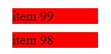

`Eleventy` has a nice feature for creating a pagination with ease. Continue reading if you want to break your single page with many items into many pages with only few items.

# Setup

We simulate a asynchronous request that fetches many data from a server. To add a new collection in `eleventy` you have to provide a configuration and call `eleventyConfig.addCollection` within the function:

```js
// project/.eleventy.js


module.exports = function(eleventyConfig) {
  eleventyConfig.addCollection("manyData", async () =>
    new Promise(resolve => {
      const results = [];
      for(var i = 0; i < 100; i++) {
        results.push({
          id: i,
          text: `item ${i}`
        });
      }
      resolve(results);
    })
  );
}

```

The `addCollection` function accepts a function as parameter that must return an array with data. If you return a `Promise` `eleventy` will wait until it resolves.

# How it works

You need a `frontmatter` header that defines the collection, the size of each sub collection and some other stuff. 

<!-- embedme project/index.njk#L1-L6 -->
```md
---
pagination:
  data: collections.manyData
  size: 2
  reverse: true
---
```

As you can see, I am reversing the collection here. In this simple example, this is not very useful because I would be able to reverse the collection in the `.eleventy.js` config, too. In a subsequent blog post you will see why you might need this stuff.

To iterate over the subcollection, `eleventy` provides you the `pagination` object that contains a property named `items`. It can be used as any other collection.

<!-- embedme project/index.njk#L8-L10 -->
```html

    <div style="background-color: red; margin: 10px; width: 100px;">{{ item.text }}</div>

```

Result:



# Simple Navigation

The best pagination is worth nothing without a possibility to jump to the next page. `Eleventy` has a [very good documentation](https://www.11ty.dev/docs/pagination/nav/) about it. A very simple navigation consists of two arrows:

<!-- embedme project/index.njk#L12-L18 -->
```html

    <span><a href="{{ pagination.href.previous }}">&lt;</a></span>



    <span><a href="{{ pagination.href.next }}">&gt;</a></span>

```

Result:


# Summary 

Pagination done easily! You learned some basics about pagination in `eleventy`. Next time I show you how you can create a more sophisticated navigation bar.

----

# Found a typo?
As I am not a native English speaker, it is very likely that you will find an error. In this case, feel free to create a pull request here: https://github.com/gabbersepp/dev.to-posts . Also please open a PR for all other kind of errors.

Do not worry about merge conflicts. I will resolve them on my own. 
