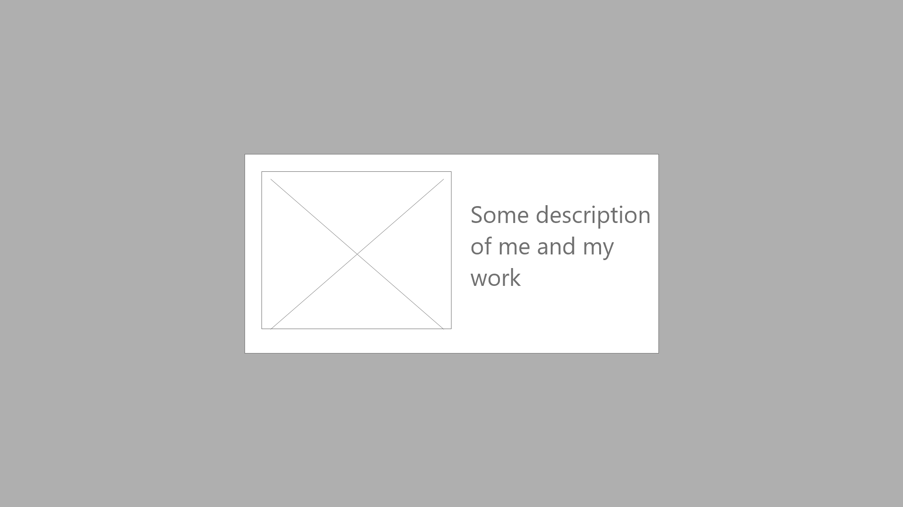
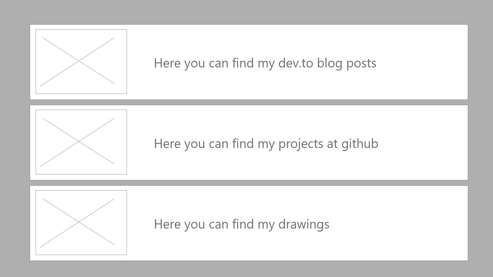
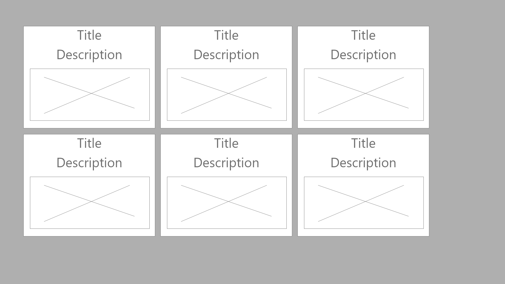

In the last articles I showed you how you can fetch tweets, their images and display them within your `eleventy` page. Also I modified my build process to upload the files through a HTTP upload endpoint.

In this article you learn some `eleventy` basics that we will need in order to create a generic design.

# My design draft
Of course I am a bad designer. So I have problems choosing the right colors and combining the right ones to make it look great. But I know how my page should look like. At least I have some sort of idea that I want to try out.

## The start screen
It should show a picture of me and some text describing me and the content that can be found at this page. Somehow it should look like this:




## The overview page
I want to divide the page into three areas:
+ Github projects
+ dev.to blog posts
+ Drawings

I don't like a simple navigation bar for this task, also I want to make it easy for the viewer to see what every section contains. So I decided to display three horizontal `div` container, each containing a picture and some text.



## The sub pages
I want an unique look over all sections. Also every section will have some kind of title, description and image.



# Some `eleventy` basics
With `eleventy` you can write your content with `markdown`. This is good if you have articles or something like that. But for a general page structure it is not enough. With `markdown` you can not place boxes next to each other and so on. So I decided to go with the template engine [`nunjucks`](https://mozilla.github.io/nunjucks/). Eleventy supports it out of the box.

## Composing templates
Let's say, you have an `index.njk` file like this:

```html
<html>
    <body>
        <h1>What a cool site</h1>
        <!-- place content here -->
    </body>
</html>
```

and you want to have different views that should all be placed into this generic construct. For example this `me.njk`:

```html
<p>I am a full stack developer</p>
```

You need two things:

**At first** you create a file `_includes/base.njk` and insert the base `HTML` construct. To place content somewhere in your `nunjucks` file, you have to use `{{ content | safe }}`:

```html
<html>
    <body>
        <h1>What a cool site</h1>
        {{ content | safe }}
    </body>
</html>
```

The `safe` filter must be used in order to allow the insertion of `HTML`.

**Then you** need to tell the `index.njk` what template it is based on. This is done by using the frontmatter of that file:

```html
---
layout: index
---
<p>I am a full stack developer</p>
```

>`Eleventy` searches for `layout` files within the directory `_includes`. But you can change this behavior using a `.eleventy.js` config file.

[Check out the example!](https://github.com/gabbersepp/dev.to-posts/tree/master/blog-posts/private-page/eleventy-design/project)

## Using variables to set page title
Of course you want a unique page title on every page. This can also be done using the frontmatter of the pages. First you insert the title tag into the `base.njk`:

```html
    <head>
        <title>{{ pageTitle }}</title>
    </head>
```

And in `index.njk` you can define the variable:

```html
---
layout: base
pageTitle: Index of my cool site
---
<p>I am a full stack developer</p>
```

## Data cascade
You can combine as much includes as you like and define variables in every include. All frontmatter data is merged. If a key appears twice, the first appearance wins.

**Example:**
Create a new file `cascade.njk` with following content:

```html
<!-- project/cascade.njk -->

---
layout: cascade
pageTitle: Index of my cool site
---
<p>I am a full stack developer</p>
```

And a file `_includes/cascade.njk` with this content:

```html
<!-- project/_includes/cascade.njk -->

---
layout: base
pageTitle: This title is not used
---
{{ content | safe }}
```

Even though `_includes/cascade.njk` defines another title, the result looks like this:

```html
<!-- project/_site/cascade/index.html -->

<html>
    <head>
        <title>Index of my cool site</title>
    </head>
    <body>
        <h1>What a cool site</h1>
        <p>I am a full stack developer</p>
    </body>
</html>
```

So duplicate keys are ignored.

## Including templates in nunjuck
Inheritance by using the frontmatter `layout` property is handled by `eleventy`. But you are not restricted to this mechanism. YOu also can include templates within `nunjuck` files: ``

## Passing data to nunjuck includes
Let's say you have this `.eleventy.js` file:

```js
module.exports = function(eleventyConfig) {
  eleventyConfig.addCollection("many_data_entries", () => [1,2,3,4,5,6]);
}
```

And a `_include/entries.njk` file:
```html
<!-- project/_includes/entries.njk -->



    <p>{{ d }}</p>

```

And in the root folder a new view, named `include.njk`:

```html
<!-- project/include.njk -->

---
layout: base
pageTitle: Example of includes
---



<p>This shows how you can include files using the nunjuck template engine and pass data to the included file</p>

```

This view inherits from `base.njk` and includes another `nunjuck` template. To enable `entries.njk` to render the collection's data, you can set a new variable with this line:

``

>**Note:** Of course you must set it before you include the other template file.

# The base construct of my portfolio page


----

# Found a typo?
As I am not a native English speaker, it is very likely that you will find an error. In this case, feel free to create a pull request here: https://github.com/gabbersepp/dev.to-posts . Also please open a PR for all other kind of errors.

Do not worry about merge conflicts. I will resolve them on my own. 