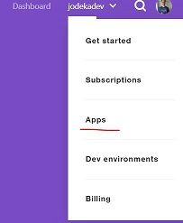
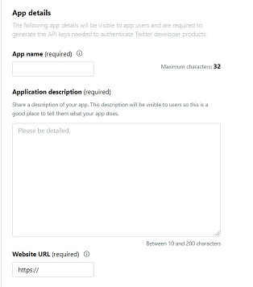
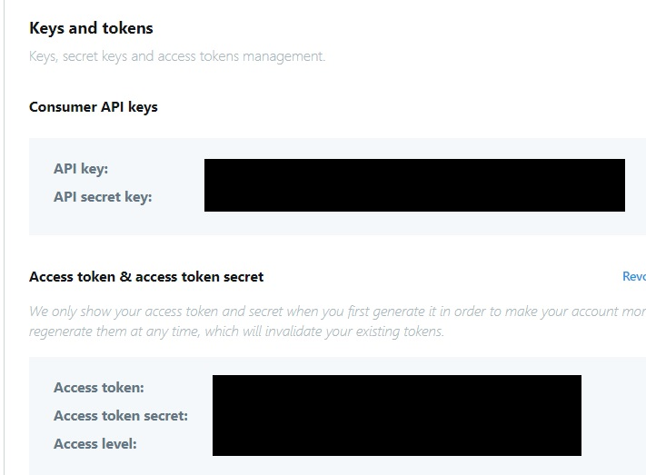
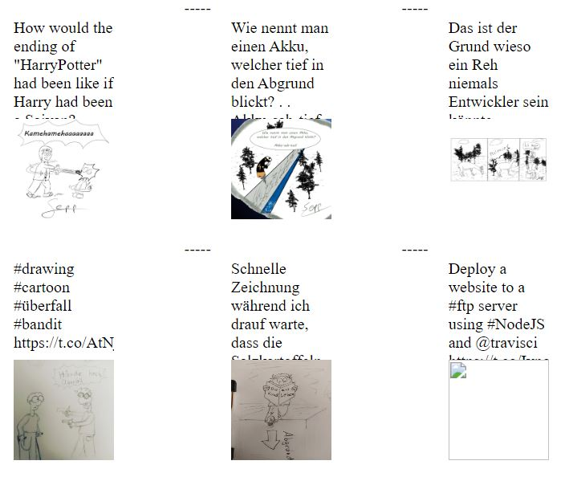

In the last articles we created a static website with `11ty` and configured `travis-ci` to deploy the site to a FTP server. Now we will look at the `Twitter API` and investigate how we can fetch tweets and display them in our `11ty` page.

# Usecase
I already wrote about my motivation to fetch tweets here:



**TL;DR**

I publish my drawings on [Twitter](https://twitter.com/JosefBiehler) and I want to fetch the from there and publish them at my site. This reduces the effort to maintain that stuff.

>**Example:** Please go to [biehler-josef.de](https://www.biehler-josef.de/drawing/index.html) to see this how this can look like.

# My idea
I  publish a tweet with specific hashtags. If I use them all the time, I just have to look for the tweets that contain the hashtag `drawing` (or any other hashtag). The twitter API delivers only the latest 200 tweets so we need some kind of data store for the tweets.

I will do this:
+ load all tweets from `tweets.json`
+ get the highest id from all tweets
+ load all latest tweets that are older than `maxId`
+ merge the existing with the new ones
+ save them to `tweets.json`
+ provide all tweets to `11ty` and use them in a template

**Travis integration**

In an ideal world the CI build runs every day and pushes the new tweets to the git repository. But that will be the subject of one of the following articles.

# Get Access to Twitter API
>Twitter provides a very good [documentation](https://developer.twitter.com/). So feel free to take a look into it!

+ Log into the twitter developer page
+ create an app

+ fill out the required fields


Then you get access tokens and secret keys. Please write them down because they are not displayed again after you close the page!



# Fetching tweets
I want all tweets from my own account but exclude retweets and answers. This can be done with [user_timeline](https://developer.twitter.com/en/docs/tweets/timelines/api-reference/get-statuses-user_timeline).

```js
// project/first/twitter.js#L15-L22

timeline = await client.get("statuses/user_timeline", {
    screen_name: "JosefBiehler",
    exclude_replies: true,
    include_rts: false,
    tweet_mode: "extended",
    count: 30,
    //since_id: <id of the latest tweet stored on your disc> 
});
```
Note the parameter `since_id`. It is used later to retrieve only tweets that are newer than those stored in the `JSON` file.

The result does not contain a completely filled tweet. To retrieve the full text, the hashtags and all media items related to the tweet, you must use [show](https://developer.twitter.com/en/docs/tweets/post-and-engage/api-reference/get-statuses-show-id):

```js
// project/first/twitter.js#L24-L29

for (var i = 0; i < timeline.length; i++) {
    let tweet = timeline[i];
    timeline[i] = await client.get(`statuses/show/${tweet.id_str}`, {
        tweet_mode: "extended"
    });
}
```

The relevant structure looks like this:

```json
{
	entities: {
		hashtags: [
			{ text: "" }
		]
	},
	full_text: "complete text of the tweet",
	created_at: <date of the tweet>,
	id_str: "<id as string, use this instead of 'id'>",
	extended_entities: {
		media: [
			{
				media_url: "<url to image>"
			}
		]
	}
}
```
>**Please note** the field `id_str`. During my tests I discovered that `id` differs from `id_str`. I think this is because `Javascript` can not handle such big numbers, so I use `id_str` and convert it explicit to `BigInt`.

# The first test
The code above is sufficient for displaying the tweet, it's hashtags and it's image. But when you render more than just a few on your page, you will encounter massive performance problems. The images will load very slowly.

[Try it out!](https://github.com/gabbersepp/dev.to-posts/tree/master/blog-posts/private-page/fetch-tweets/project/first/README.md) 



# Performance considerations
You should keep your images locally. Not only because of the mentioned performance issues but also because it is not fair to use Twitter as image hosting service ;-) 

To download them, I selected the npm package [request](https://www.npmjs.com/package/request). The code is very simple:

```js
// project/download/downloader.js

const request = require("request");
const fs = require("fs");

function download(twitterUrl, id) {
    const ext = twitterUrl.split("\.").reverse()[0];
   
    return new Promise(resolve => {
        const path = `/data/${id}.${ext}`;
        const stream = fs.createWriteStream(`.${path}`);
        request(twitterUrl).pipe(stream);
        stream.on("finish", () => resolve(path));
    });
}

module.exports = download;
```

It takes the twitter url, downloads the content and stores the result anywhere.

The twitter code must be slightly adjusted. Also in this more complex example I load the tweets outside of the eleventy config to avoid too heavy load during eleventy startup.

```js
// project/download/twitter.js#L46-L54

for (var i = 0; i < results.length; i++) {
    const x = results[i];
    if (!x.mediaUrl) {
        continue;
    }
    const path = await download(x.mediaUrl, x.id);
    x.twitterMediaUrl = x.mediaUrl;
    x.mediaUrl = path;
}
```

Again you can test the [full example](https://github.com/gabbersepp/dev.to-posts/tree/master/blog-posts/private-page/fetch-tweets/project/download/README.md).

As mentioned in the beginning, in my real portfolio project I fetch the latest tweet from the JSON file and pass the biggest tweet id as parameter `since_id` to the Twitter API. 

# Summary
I showed you quickly how you can use the twitter API. Also you learned how you can download the media files from a tweet for a more performant website. And last but not least you get a clue how to use that in combination with eleventy.

Feel free to try out both example projects and let me know what you think about this topic.

# What is next
Unfortunately I had to rework the publishing process. The FTP strategy does not work. Also I want to show you how I use eleventy to build a more complex design.

----

# Found a typo?
As I am not a native English speaker, it is very likely that you will find an error. In this case, feel free to create a pull request here: https://github.com/gabbersepp/dev.to-posts . Also please open a PR for all other kind of errors.

Do not worry about merge conflicts. I will resolve them on my own. 
