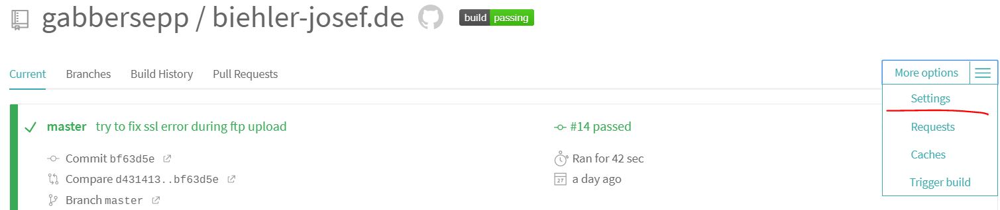
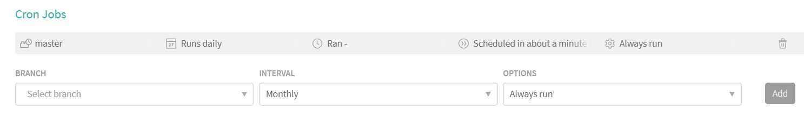
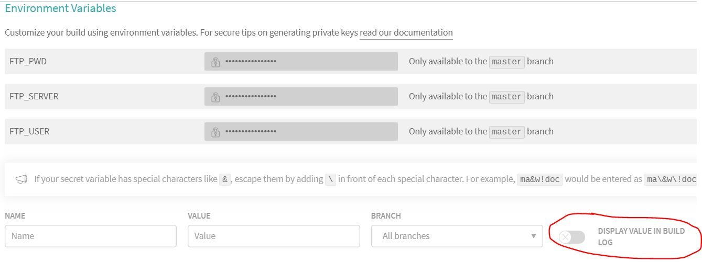

>**Note**: You can checkout the runnable example at the [biehler-josef.de repo](https://github.com/gabbersepp/biehler-josef.de/tree/1.eleventy.ftp.travis). Choose tag `1.eleventy.ftp.travis`.

In the last article I showed you how you can create a static website using `11ty`. Now we want to publish the output somewhere. As I am paying for webspace it makes sense, that I deploy the page there by using a `ftp client`. Of course you can choose any webhoster for this.

# FTP upload
I choose [basic-ftp](https://www.npmjs.com/package/basic-ftp) for this task as it is very easy to use.

All HTML resides in `/page/dist` so we just need to take all of the directory and upload it to the root directory.

```js
// code/ftp.js

const ftp = require("basic-ftp")
 
async function upload() {
    const client = new ftp.Client();
    client.ftp.verbose = true;

    try {
        await client.access({
            host: process.env.FTP_SERVER,
            user: process.env.FTP_USER,
            password: process.env.FTP_PWD,
            secure: true
        });
        await client.uploadFromDir("./page/dist", "./");
    } catch(err) {
        console.log(err);
    }

    client.close();
}

upload()
```

Please note the usage of environment variables here. Later on I show you how to use them in travis.

# Travis
The page should be built after each commit. As my site is open source I can use [travis](https://travis-ci.org) for free.

<!-- embedme code/travis.yml -->
```yml
language: node_js

cache:
  directories:
    - ~/.npm

node_js:
  - '11'

script:
  - npm run 11ty
  - npm run upload
```

It is a very simple config.
+ you define the language (`node_js`)
+ cache `.npm` to speed up your build. Otherwise `travis` will download all dependencies in every build
+ define the node version
+ list all npm scripts that should be executed.


I do not want to write about the usage of travis here. [dev.to](https://dev.to) contains a lot of posts about it. If you have question, leave a comment :thumbsup: 

**Run the build every day:**

You should configure a cron job to ensure that your build runs at least once per day and can fetch the latest tweets and [dev.to](https://dev.to) posts.

This must be done in the WebUI. First in your build go to the settings:


Here you can create cron jobs the way you want. My build should run every day:


**Set environment variables:**

The code of my page is public so I don't want to commit my ftp user data. For this and similar tasks you can configure environment variables. Those are not visible to anyone.



Of course you should not display the values in your build log because this is public to everyone.

# Summary
This was a quick introduction into travis. Of course you can upload your files every time manually to the ftp server. But this is annoying and consumes time. So I suggest you to familiarize yourself with one of the free CI server. It is definitely worth a look!

----

# Found a typo?
As I am not a native English speaker, it is very likely that you will find an error. In this case, feel free to create a pull request here: https://github.com/gabbersepp/dev.to-posts . Also please open a PR for all other kind of errors.

Do not worry about merge conflicts. I will resolve them on my own. 