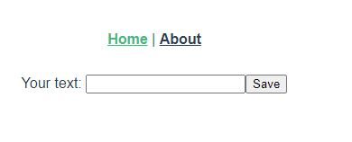
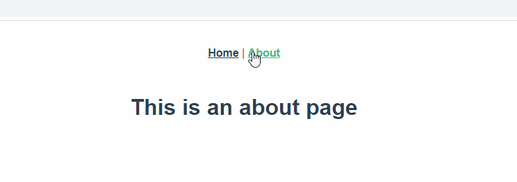

Let's say you have a input field and routes configured:



How can you avoid that the user navigates to a route if the inputfield contains unsaved text? I made a few tries to find a solution for that but did not found anything. So here is what I have done to solve this problem.

Find the full runnable example here: [Click me!](https://github.com/gabbersepp/dev.to-posts/tree/master/blog-posts/vuejs-avoid-routes/code/example)

# Solution
First, define a new global function:

```ts
// ./code/example/src/utils/Global.ts
```

Then use it to set the flag after the user make some input:

```ts
// ./code/example/src/views/Home.vue#L16-L23
```

After a successful saving, reset the flag:

```ts
// ./code/example/src/views/Home.vue#L25-L28
```

Now replace the router's `push` function:

```ts
// ./code/example/src/router/index.ts#L23-L33
```

# Result
Here is what I got:



# Conclusion
This workaround works really well but I'm wondering whether there isn't a better possibility? Do you know how this can be achieved using a native solution? Maybe I just was not cleevr enough to type in the correct search terms into google :sweat_smile: Just let me know.

----

# Found a typo?
As I am not a native English speaker, it is very likely that you will find an error. In this case, feel free to create a pull request here: https://github.com/gabbersepp/dev.to-posts . Also please open a PR for all other kind of errors.

Do not worry about merge conflicts. I will resolve them on my own. 
